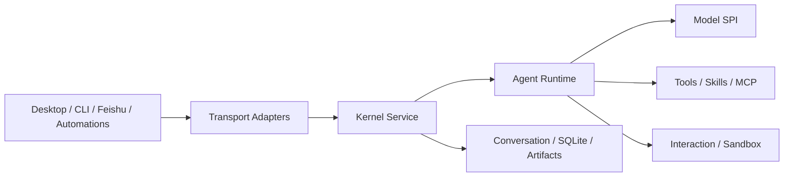

<div align="center">
  
  <h1>Foya</h1>
  <p><strong>An open-source, local-first personal agent system with bring-your-own-model support</strong></p>
  <p>Connect your own models, work with local projects, review changes, and run long-lived tasks.</p>

  <p>
    <a href="https://github.com/freesoulcode/foya/actions/workflows/ci.yml"></a>
    
    
    
    
    
  </p>

  <p>
    <a href="./README.zh-CN.md">简体中文</a>
    &middot;
    <a href="https://github.com/freesoulcode/foya/releases">Releases</a>
    &middot;
    <a href="https://freesoulcode.github.io/foya/docs/">Documentation</a>
    &middot;
    <a href="https://freesoulcode.github.io/foya/docs/quick-start/">Quick Start</a>
    &middot;
    <a href="./CONTRIBUTING.md">Contributing</a>
    &middot;
    <a href="https://github.com/freesoulcode/foya/issues">Issues</a>
  </p>
</div>

Foya is built around an independent Go kernel. The desktop app, CLI,
automations, and messaging channels share the same agent runtime, session
state, and permission system. Data is stored locally by default, and model
providers are selected and configured by the user.

> [!IMPORTANT]
> Foya is in early development. APIs, configuration, and storage formats may
> change. Building from source is currently recommended. The desktop app
> primarily targets macOS and Linux; Windows support is still being improved.

## Features

- **Local first:** Sessions, project configuration, event logs, and artifacts
  are stored on the local machine by default.
- **Bring your own model:** Connect OpenAI-compatible endpoints and select
  different connections and models per session.
- **Agent runtime:** Tool calls, message queues, cancellation, context
  compaction, and concurrent child agents.
- **Reviewable file changes:** Inspect, keep, or revert changes while detecting
  external conflicts.
- **Permission controls:** Manual approval, automatic approval, full access,
  and platform sandboxing.
- **Extensible:** Skills, MCP, rules, memory, hooks, plugins, and custom
  commands.
- **Multiple entry points:** Tauri desktop app, CLI, Feishu bot, and scheduled
  automations.
- **Remote kernels:** One-click SSH deployment and tunnels, plus authenticated
  HTTPS deployment for a single-tenant server.
- **Multimodal workflows:** Image input, artifacts, and a visual image/video
  generation canvas.
- **Observability:** OpenTelemetry traces, metrics, and OTLP export.

## Quick Start

### Requirements

Running the kernel or CLI requires Go 1.26 or later.

Desktop development also requires:

- Node.js 22.12+
- pnpm 10
- A Rust toolchain
- The [Tauri 2 prerequisites](https://v2.tauri.app/start/prerequisites/) for
  your platform

### Run the Desktop App

```bash
git clone https://github.com/freesoulcode/foya.git
cd foya

make fe-install
make desktop-dev
```

After the app starts, open **Settings > Model Connections** and add a base URL,
API key, and model. You can then create a project-backed or standalone chat.

### Use the CLI

When no model connection exists yet, import an OpenAI-compatible connection
through environment variables:

```bash
export FOYA_PROVIDER_BASE_URL="https://your-provider.example/v1"
export FOYA_PROVIDER_API_KEY="your-api-key"
export FOYA_PROVIDER_MODEL="your-model"

make build
./bin/foya exec "Analyze this project and explain its main modules"
```

Common commands:

| Command | Purpose |
| --- | --- |
| `foya` | Start the persistent kernel |
| `foya exec <prompt>` | Run a one-shot headless task |
| `foya projects ...` | Manage projects |
| `foya agents` | List available agents |
| `foya skills ...` | List or toggle skills |
| `foya rules ...` | Manage rules |
| `foya memory ...` | Manage memory |
| `foya mcp ...` | Manage MCP servers |
| `foya web-search ...` | Configure and test web search |
| `foya bot` | Start the kernel with the Feishu long connection |

See the [CLI documentation](https://freesoulcode.github.io/foya/docs/cli/) for complete
usage.

## How It Works



The kernel owns session state and uses the event log as its source of truth.
Clients submit input and project state instead of maintaining separate agent
implementations. The same session can therefore be observed and continued
through different entry points.

See the [architecture documentation](https://freesoulcode.github.io/foya/docs/technical/architecture/)
for more details.

## Repository Layout

```text
.
|-- cmd/foya/          # Kernel, CLI, and bot entry points
|-- internal/          # Agent runtime, tools, storage, and integrations
|-- apps/desktop/      # Tauri 2 and Vue 3 desktop app
|-- apps/site/         # Astro and Starlight website and documentation
|-- Makefile           # Development, test, and build commands
`-- go.mod
```

Key kernel packages:

| Directory | Responsibility |
| --- | --- |
| `internal/kernel` | Composition root and transport-neutral application service |
| `internal/server` | REST, SSE, authentication, and wire formats |
| `internal/conversation` | Sessions, messages, events, queues, projections, and compaction |
| `internal/model` | Model SPI and OpenAI-compatible adapter |
| `internal/agent` | Agent loop, prompts, title generation, and tool execution |
| `internal/interaction` | Approval and structured user questions |
| `internal/subagent` | Agent definitions, child sessions, scheduling, and budgets |
| `internal/workflow` | Custom commands and Plan, Spec, and Goal workflows |
| `internal/tool` | Tool interfaces, registry, and built-in tools |
| `internal/mcpclient`, `internal/skill` | MCP and skills |
| `internal/canvas`, `internal/artifact` | Creative canvases and generated assets |
| `internal/channel`, `internal/automation` | Messaging and scheduled tasks |
| `internal/storage`, `internal/telemetry` | SQLite, locking, traces, and metrics |

## Development

```bash
make help           # List available commands
make test           # Run Go tests
make vet            # Run Go static analysis
make build          # Build bin/foya
make desktop-dev    # Start the desktop development environment
make desktop-build  # Build desktop installers
make site-install   # Install website dependencies
make site-dev       # Start the documentation development server
make site-check     # Check documentation, links, and Astro pages
make site-build     # Build the static website
```

Documentation source files live in
[`apps/site/src/content/docs`](./apps/site/src/content/docs). Update the
relevant documentation when changing behavior or configuration.

## Project Status

Implemented:

- Persistent Go kernel, local Unix socket, REST, and SSE.
- Managed SSH deployment and tunnels, plus authenticated single-tenant HTTPS
  deployment.
- Multi-session agent loop, concurrent child agents, approvals, cancellation,
  queues, and context compaction.
- `bash`, `read`, `write`, `edit`, `delete`, web search, web fetch, and browser
  tools.
- MCP stdio, Streamable HTTP, legacy SSE, tools, resources, and prompts.
- Feishu long connection, source allowlists, session continuation, Markdown
  replies, and image input.
- Scheduled automations, isolated session history, image artifacts, and the
  visual media generation canvas.

In progress:

- Complete MCP OAuth and client-owned MCP.
- Windows desktop commands and restricted execution.
- Multi-tenant deployment and unified system keychain credential storage.
- More media types, signed builds, and additional platform installers.

## Security

Foya can read files, run commands, and access networks. Start with the `manual`
approval mode, enable `full_access` only in isolated and recoverable
environments, and connect only trusted MCP servers, skills, plugins, and hooks.
Do not use `--allow-all` with a public Feishu app.

See the [security model](https://freesoulcode.github.io/foya/docs/technical/security/) for
trust boundaries and known limitations. Report vulnerabilities privately
according to the [security policy](./SECURITY.md).

## Contributing

Issues and focused pull requests are welcome. See
[CONTRIBUTING.md](./CONTRIBUTING.md) for the development commands and submission
guidelines.

## License

Foya is licensed under the [Apache License 2.0](./LICENSE).
