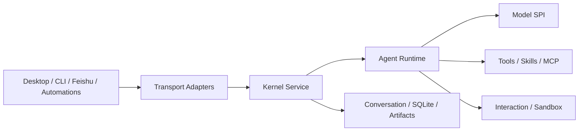

<div align="center">
  
  <h1>Foya</h1>
  <p><strong>一个开源、本地优先、支持自带模型的个人 Agent 系统</strong></p>
  <p>连接你自己的模型，处理本地项目，审查文件变更，并运行长期任务。</p>

  <p>
    <a href="https://github.com/freesoulcode/foya/actions/workflows/ci.yml"></a>
    
    
    
    
    
  </p>

  <p>
    <a href="./README.md">English</a>
    &middot;
    <a href="https://github.com/freesoulcode/foya/releases">发布版本</a>
    &middot;
    <a href="https://freesoulcode.github.io/foya/docs/">文档</a>
    &middot;
    <a href="https://freesoulcode.github.io/foya/docs/quick-start/">快速开始</a>
    &middot;
    <a href="./CONTRIBUTING.md">贡献指南</a>
    &middot;
    <a href="https://github.com/freesoulcode/foya/issues">问题反馈</a>
  </p>
</div>

Foya 基于独立的 Go 内核构建。桌面应用、CLI、自动化任务和消息渠道共用同一套
Agent 运行时、会话状态和权限系统。数据默认存储在本机，模型服务由用户自行选择
和配置。

> [!IMPORTANT]
> Foya 仍处于早期开发阶段。API、配置和存储格式都可能变化。目前推荐从源码构建。
> 桌面应用主要面向 macOS 和 Linux；Windows 支持仍在完善中。

## 功能特性

- **本地优先：** 会话、项目配置、事件日志和产物默认存储在本机。
- **自带模型：** 连接 OpenAI 兼容接口，并可为不同会话选择不同连接和模型。
- **Agent 运行时：** 支持工具调用、消息队列、取消、上下文压缩和并发子 Agent。
- **可审查的文件变更：** 检查、保留或回退变更，并检测外部冲突。
- **权限控制：** 支持手动审批、自动审批、完全访问和平台沙箱。
- **可扩展：** 支持 Skills、MCP、规则、记忆、Hooks、插件和自定义命令。
- **多入口：** 提供 Tauri 桌面应用、CLI、飞书机器人和定时自动化任务。
- **远程内核：** 支持一键 SSH 部署和隧道，也支持带认证的单租户 HTTPS 部署。
- **多模态工作流：** 支持图像输入、产物管理和可视化图片/视频生成画布。
- **可观测性：** 支持 OpenTelemetry traces、metrics 和 OTLP 导出。

## 快速开始

### 环境要求

运行内核或 CLI 需要 Go 1.26 或更高版本。

桌面端开发还需要：

- Node.js 22.12+
- pnpm 10
- Rust 工具链
- 当前平台对应的 [Tauri 2 前置依赖](https://v2.tauri.app/start/prerequisites/)

### 运行桌面应用

```bash
git clone https://github.com/freesoulcode/foya.git
cd foya

make fe-install
make desktop-dev
```

应用启动后，打开 **Settings > Model Connections**，添加 base URL、API key
和模型。随后即可创建绑定项目的会话，或创建独立聊天。

### 使用 CLI

如果还没有配置模型连接，可以通过环境变量导入一个 OpenAI 兼容连接：

```bash
export FOYA_PROVIDER_BASE_URL="https://your-provider.example/v1"
export FOYA_PROVIDER_API_KEY="your-api-key"
export FOYA_PROVIDER_MODEL="your-model"

make build
./bin/foya exec "Analyze this project and explain its main modules"
```

常用命令：

| 命令 | 用途 |
| --- | --- |
| `foya` | 启动持久化内核 |
| `foya exec <prompt>` | 运行一次无界面的任务 |
| `foya projects ...` | 管理项目 |
| `foya agents` | 列出可用 Agent |
| `foya skills ...` | 列出或切换 Skills |
| `foya rules ...` | 管理规则 |
| `foya memory ...` | 管理记忆 |
| `foya mcp ...` | 管理 MCP 服务器 |
| `foya web-search ...` | 配置并测试 Web Search |
| `foya bot` | 启动带飞书长连接的内核 |

完整用法请查看 [CLI 文档](https://freesoulcode.github.io/foya/docs/cli/)。

## 工作原理



内核负责管理会话状态，并以事件日志作为事实来源。客户端提交输入和项目状态，
而不是各自维护独立的 Agent 实现。因此，同一个会话可以通过不同入口观察和继续。

更多细节请查看
[架构文档](https://freesoulcode.github.io/foya/docs/technical/architecture/)。

## 仓库结构

```text
.
|-- cmd/foya/          # 内核、CLI 和机器人入口
|-- internal/          # Agent 运行时、工具、存储和集成
|-- apps/desktop/      # Tauri 2 和 Vue 3 桌面应用
|-- apps/site/         # Astro 和 Starlight 官网及文档站
|-- Makefile           # 开发、测试和构建命令
`-- go.mod
```

关键内核包：

| 目录 | 职责 |
| --- | --- |
| `internal/kernel` | 组合根和与传输无关的应用服务 |
| `internal/server` | REST、SSE、认证和 wire formats |
| `internal/conversation` | 会话、消息、事件、队列、投影和压缩 |
| `internal/model` | 模型 SPI 和 OpenAI 兼容适配器 |
| `internal/agent` | Agent 循环、提示词、标题生成和工具执行 |
| `internal/interaction` | 审批和结构化用户问题 |
| `internal/subagent` | Agent 定义、子会话、调度和预算 |
| `internal/workflow` | 自定义命令，以及 Plan、Spec、Goal 工作流 |
| `internal/tool` | 工具接口、注册表和内置工具 |
| `internal/mcpclient`, `internal/skill` | MCP 和 Skills |
| `internal/canvas`, `internal/artifact` | 创意画布和生成产物 |
| `internal/channel`, `internal/automation` | 消息渠道和定时任务 |
| `internal/storage`, `internal/telemetry` | SQLite、锁、traces 和 metrics |

## 开发

```bash
make help           # 查看可用命令
make test           # 运行 Go 测试
make vet            # 运行 Go 静态分析
make build          # 构建 bin/foya
make desktop-dev    # 启动桌面端开发环境
make desktop-build  # 构建桌面端安装包
make site-install   # 安装网站依赖
make site-dev       # 启动文档开发服务器
make site-check     # 检查文档、链接和 Astro 页面
make site-build     # 构建静态网站
```

文档源码位于 [`apps/site/src/content/docs`](./apps/site/src/content/docs)。
修改行为或配置时，请同步更新相关文档。

## 项目状态

已实现：

- 持久化 Go 内核、本地 Unix socket、REST 和 SSE。
- 托管式 SSH 部署和隧道，以及带认证的单租户 HTTPS 部署。
- 多会话 Agent 循环、并发子 Agent、审批、取消、队列和上下文压缩。
- `bash`、`read`、`write`、`edit`、`delete`、web search、web fetch 和浏览器工具。
- MCP stdio、Streamable HTTP、legacy SSE、tools、resources 和 prompts。
- 飞书长连接、来源 allowlist、会话续接、Markdown 回复和图像输入。
- 定时自动化、隔离会话历史、图像产物和可视化媒体生成画布。

进行中：

- 完整 MCP OAuth 和客户端持有的 MCP。
- Windows 桌面命令和受限执行。
- 多租户部署和统一系统钥匙串凭据存储。
- 更多媒体类型、签名构建和更多平台安装包。

## 安全

Foya 可以读取文件、运行命令并访问网络。建议从 `manual` 审批模式开始；
只有在隔离且可恢复的环境中才启用 `full_access`；只连接可信的 MCP 服务器、
Skills、插件和 Hooks。不要在公开飞书应用中使用 `--allow-all`。

请查看
[安全模型](https://freesoulcode.github.io/foya/docs/technical/security/)
了解信任边界和已知限制。漏洞请按 [安全策略](./SECURITY.md) 私下报告。

## 贡献

欢迎提交 Issue 和聚焦的 Pull Request。开发命令和提交指南请查看
[CONTRIBUTING.md](./CONTRIBUTING.md)。

## 许可证

Foya 使用 [Apache License 2.0](./LICENSE) 授权。
