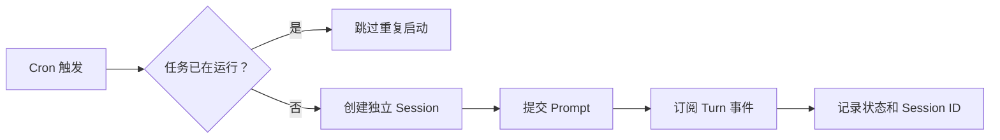

Automation 用于按计划自动执行 Agent 任务。它不是独立的 Agent 实现；每次运行都会
通过 Kernel Service 创建普通 Session，并使用相同的 Runtime、Tool 和权限系统。

## 任务配置

一项 Automation 包含：

- 名称；
- Prompt；
- Cron 表达式；
- 时区；
- 是否启用；
- Connection 和 Model；
- Project；
- Approval Mode（`auto` 或 `full_access`）。

运行状态还会记录：

- 上次状态；
- 上次错误；
- 上次 Session ID；
- 上次运行时间；
- 下次计划时间。

## 执行流程



每次运行使用独立 Session，因此：

- 历史可以单独查看；
- 文件和工具事件可审计；
- 失败不会污染上一次运行的对话；
- 可以从记录的 Session 继续人工调查。

## 调度

Automation 使用标准五段式 Cron 表达式，并按配置时区计算下次运行时间。例如，
`0 9 * * 1-5` 表示工作日 09:00 运行。

启用任务时会注册计划，停用或删除时会移除计划。内核启动后会从
`automations.json` 重新加载并注册所有启用任务。

同一 Automation 尚在运行时，新的触发不会再次启动，避免同一任务并发修改相同
资源。

## 手动运行

除了定时触发，用户也可以立即运行 Automation。手动运行遵守相同的并发检查和
Session 创建逻辑。

手动运行不会改变原 Cron 表达式或下一次计划。

## 模型和 Project

Automation 可以显式绑定 Connection、Model 和 Project。

Project 决定：

- 工具工作目录；
- 项目级 Rules、Memory 和 Skills；
- Sandbox 可写范围。

Connection 或 Project 在运行前已经不可用时，本次运行会失败并记录错误，不会
自动改用其他项目或模型。

## 权限模式

Automation 创建的 Session 使用 `auto` 或 `full_access`，默认值为 `auto`。
Automation 不接受 `manual`，因为调度器没有可靠的交互方来处理等待中的审批。

Auto 使用 Guardian 审核副作用；Full Access 会跳过普通审批并放开 Sandbox，只应
在已有额外隔离的环境中使用。

建议无人值守任务：

1. 使用专门 Project；
2. 限制可用 Tool；
3. 优先使用 Auto；
4. 保证任务重复执行不会产生不可接受的副作用；
5. 通过运行 Session 检查实际结果。

## 取消

运行中的 Automation 持有独立取消上下文。禁用或删除任务会取消对应 Session
Turn。

禁用计划不会自动删除以前的运行 Session，也不会删除已经产生的项目修改。

## 持久化

Automation 定义和最近状态保存在：

```text
<data-dir>/automations.json
```

具体运行历史保存在对应 Session 的 SQLite Event Log 和 Artifact Store 中。

内核重启会恢复任务配置和未来计划，但不会重放重启前尚未完成的工具调用。

## 适用任务

适合：

- 定期检查项目状态；
- 生成固定格式报告；
- 周期性运行测试或静态分析；
- 对明确输入执行幂等维护。

不适合：

- 必须频繁人工确认的任务；
- 无法判断重复执行影响的外部操作；
- 依赖未持久化交互状态的长流程；
- 需要保证严格一次执行的金融或生产变更。

## 当前边界

- 同一 Automation 不会并发运行。
- 调度依赖 Foya 内核持续运行。
- 没有分布式锁或多实例调度协调。
- 未完成运行不会在重启后自动续跑。
- Automation 不能提供超出普通 Session 的工具和权限。
