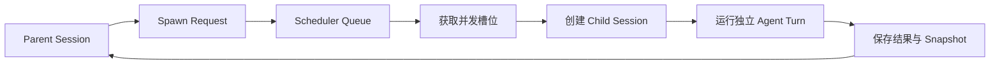

子 Agent 用于执行边界清晰、可以独立完成的任务。Foya 为每次委派创建正式 Child
Session，而不是在父模型请求中模拟一段临时对话。

## Agent Definition

Agent Definition 描述一个可复用角色，包括：

- Name 和 Description；
- 可选 Model；
- 允许使用的 Tool；
- 最大 Turn 数；
- Timeout；
- 角色指令正文。

内置定义包括：

| Agent | 用途 |
|---|---|
| Explorer | 只读检查代码库并返回证据 |
| Researcher | 使用 Web 能力研究外部资料 |
| Worker | 完成实现、修改和验证 |

用户定义位于：

```text
~/.agents/agents/<name>.md
<project>/.agents/agents/<name>.md
```

同名时，Project Definition 高于 User Definition，高于 Built-in Definition。

## 定义快照

创建 Child Session 时，Foya 解析 Definition 并保存：

- Definition Ref；
- Name；
- 内容 Digest；
- 指令正文；
- 允许 Tool；
- 最大 Turn 数。

这些字段成为 Child Session 的不可变运行快照。之后修改磁盘上的 Definition 不会
改变已经启动的 Child 身份。

Agent 调度 Tool 会从 Definition 的 Tool 列表中移除，防止 Child 再递归创建
Child。当前实际深度固定为一层。

## 创建流程



Spawn Request 记录父 Session、父 Tool Call、根 Run、任务、Definition 和 Context
Selection。

异步运行状态为：

```text
queued → running → completed
               ↘ failed
               ↘ cancelled
```

Child Session 创建完成时还会发布 `subagent_started` 生命周期事件，但 `started`
不是持久 Snapshot Status。内核重启时，未完成 Snapshot 会收敛为 `interrupted`。

## 上下文传递

父 Session 的全部历史不会自动复制。调用方显式选择：

| Mode | 内容 |
|---|---|
| `none` | 只传递任务 |
| `selected` | 传递指定 Event Seq 的消息 |
| `last_n_turns` | 传递最近若干 User Turn |
| `summary` | 传递有界的历史文本 |

传递内容总量限制为 24000 字符；Summary Mode 会先限制单条内容。选择结果以 JSON
消息列表附在任务后，并标记为不可信参考数据。

这套机制与主 Session Compaction 不同。它只负责给 Child 构造任务包，不创建父
Session Checkpoint。

## Child Session

Child 继承父 Session 的：

- Connection；
- 默认 Model；
- Reasoning Effort；
- Project；
- Approval Mode。

Definition 可以覆盖 Model，并限制 Tool 和最大 Turn 数。

Child 拥有独立 Event Log、Message History、Context、Usage 和取消状态。父 Session
只接收生命周期 Snapshot 与最终结果。

## 调度

Scheduler 控制：

| 限制 | 默认值 |
|---|---|
| 全局并发 Child | 4 |
| 单根 Session 并发 Child | 4 |
| 单根 Run 创建总数 | 64 |
| 默认最大 Turn | 20 |
| 默认 Timeout | 15 分钟 |

全局和单根并发可由设置调整。降低限制不会中断正在运行的 Child，新任务会等待槽位。

64 个 Child 是内核安全上限，不作为普通配置开放。

## Token Budget

所有属于同一 Root Run 的 Child Usage 会累计到一份 Tree Budget。

如果配置了 `max_tree_tokens`：

1. 每次 Child Provider Usage 更新累计 Token；
2. 发布 `agent_budget_updated`；
3. 达到上限后发布 `agent_budget_exceeded`；
4. 取消同一 Root Run 下仍在排队或运行的 Child。

预算使用 Provider 报告的 Total Tokens。没有 Usage 的请求无法准确计入。

## 等待与读取

Parent Agent 可以：

- 列出当前委派；
- 等待任意或全部 Run；
- 读取某个 Snapshot 及其当前或最终 Output；
- 取消指定 Run；

`read_agent_output` 不返回 Child 的完整消息历史。客户端可以通过 Snapshot 中的
`child_session_id` 打开该 Session 并读取历史；Parent Agent 默认只消费最终 Output。
等待本身也不会把 Child History 自动合并到 Parent。

## 取消传播

如果 Spawn Request 选择随父取消，Parent Turn 的 Context 取消会取消 Child Run。

删除父 Session 时，Kernel Service 会停止并删除整个后代 Session 树。单独取消 Child
不会删除已经形成的 Child History。

## 持久化

Run Snapshot 保存在：

```text
<data-dir>/agent-runs.json
```

Child Session 的消息仍保存在 SQLite。

内核重启时，原状态为 `queued` 或 `running` 的 Snapshot 会改为 `interrupted`。
Foya 不自动重放，因为 Child 可能已经产生文件或外部副作用。

## 当前边界

- Child 不能继续创建下一层 Child。
- 调度器运行在单个 Kernel 进程中，不是分布式队列。
- 父上下文传递使用有界文本，不共享运行中的对象。
- Token Budget 依赖 Provider 返回 Usage。
- 重启后未完成 Run 只会标记中断，不会续跑。
