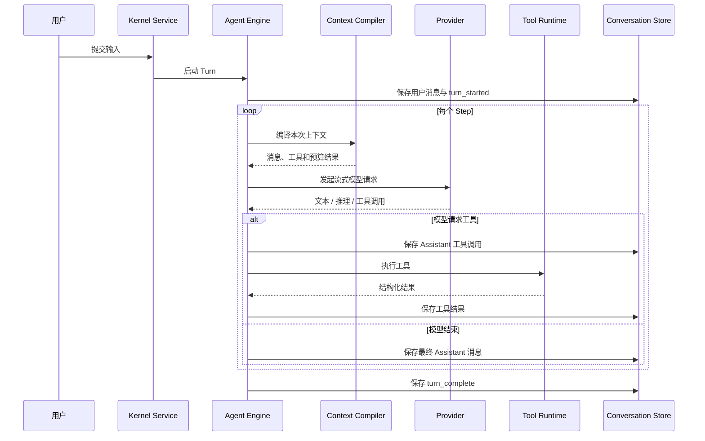

Agent Runtime 是 Foya 执行用户任务的核心。它把一次请求组织成可取消、可观测、
可持久化的回合，并在模型与工具之间循环，直到任务结束。

本文聚焦回合的执行过程。Session 的生命周期参见 [Session](./session.md)，模型
输入的组装参见[上下文](./context.md)。

## 基本概念

理解 Runtime 需要区分三个层次：

| 概念 | 含义 |
|---|---|
| Session | 长期会话身份，保存模型、项目和审批模式等配置 |
| Turn | 一次用户输入触发的完整处理过程 |
| Step | Turn 中的一次模型请求，以及随后可能发生的工具执行 |

一个 Turn 可以只包含一次 Step，也可以包含多次：

```text
用户输入
  → 模型请求
  → 工具调用
  → 工具结果
  → 模型请求
  → 最终回答
```

模型不会在工具执行期间持续运行。每次工具完成后，Foya 都会重新编译上下文并发起
新的模型请求。

## 回合入口

用户输入首先交给 Kernel Service 调度。输入可以包含：

- 文本；
- 命令标识；
- 已提交的图片附件引用；
- 用户从浏览器中选择的页面元素。

如果 Session 空闲，输入立即启动 Turn。如果 Session 正在运行或压缩上下文，
输入进入该 Session 的 FIFO 队列。

同一 Session 只允许一个活跃 Turn。这条约束保证消息顺序、工具副作用和事件序号
具有确定性。不同 Session 之间可以并发执行。

## 执行流程



### 1. 建立运行身份

每个 Turn 都有独立的 Run ID 和取消上下文。Runtime 将 Session 阶段切换为
`turn`，并记录开始时间。

Run ID 用于把同一回合产生的事件关联起来。它不是 Session ID，也不会跨回合复用。

### 2. 保存用户输入

用户消息以完成事件写入事件日志，然后记录 `turn_started`。从这一刻起，即使后续
模型请求失败，用户输入仍然属于会话事实。

首次输入还可能异步触发标题生成。标题任务不阻塞主回合，也不会覆盖用户手动设置
的标题。

### 3. 组装运行上下文

每个 Step 开始前，Runtime 都重新构建系统提示词和模型历史。输入来源包括：

- 内核静态指令；
- 项目说明；
- 当前生效的 Rules；
- 当前可用的 Memory；
- Skill 元数据；
- Session 的审批模式和运行环境；
- 有效消息历史及 Compaction Checkpoint；
- 当前暴露的 Tool Schema。

Runtime 不复用上一轮拼接完成的 Prompt。重新编译可以反映刚发生的工具结果、
规则匹配和上下文压缩。

### 4. 请求模型

Runtime 将中立的消息结构物化为 Provider 请求，并以流式方式消费：

- `text_delta`：面向用户的回答增量；
- `reasoning_delta`：模型提供的推理增量；
- `tool_call_delta`：工具名称和参数片段；
- `usage`：Provider 返回的 Token 用量；
- `done`：本次生成的结束原因；
- `error`：请求或流式处理错误。

文本和推理增量会立即广播给在线客户端。完成后，Runtime 将聚合后的 Assistant
消息一次性写入持久存储。

已完成消息中的推理内容只用于界面展示，通常不会再次发送给模型。若回合在生成
期间被取消，已经产生的推理会被明确标记为中断上下文，供后续纠正继续使用。

### 5. 解析工具调用

模型可以在一个响应中请求多个工具。Runtime 会按流中携带的索引拼接参数，并在
首次获得完整工具 ID 和名称时立即广播排队状态。

模型响应完成后，Runtime 才会执行工具。Assistant 消息会先记录工具调用，随后
每个工具结果以关联同一 Tool Call ID 的 Tool 消息写入历史。

这使历史保持标准结构：

```text
Assistant(tool_calls)
Tool(tool_call_id)
Assistant(...)
```

### 6. 执行工具

工具执行前会获得当前 Session 的工作目录、Project ID、审批模式和运行身份。
需要副作用的工具必须经过 Approval Gateway，并在适用时通过 Sandbox Runner。

明确声明可并行的工具可以进入并发通道，单个批次最多同时运行五个。其他工具按
模型给出的顺序串行执行。无论实际完成顺序如何，结果都会按原始调用顺序回灌模型。

工具失败不会直接终止整个 Turn。失败会作为带 `is_error` 状态的结构化结果返回，
模型可以据此修改参数或选择其他方案。

### 7. 决定是否继续

如果模型结束原因为 `tool_calls` 且确实生成了工具调用，Runtime 保存结果后开始
下一个 Step。

如果模型没有继续请求工具，Runtime 运行停止 Hook，然后结束回合。Hook 可以要求
Runtime 继续处理，但不能扩大工具或系统权限。

## 结束状态

Turn 最终会记录 `turn_complete`，状态主要包括：

| 状态 | 含义 |
|---|---|
| completed | 模型正常完成任务 |
| cancelled | 用户停止或上层取消 |
| failed | Provider、上下文或运行过程发生错误 |

取消不是简单丢弃 goroutine。Runtime 会停止 Provider 流和可取消工具，保存已有的
部分 Assistant 内容，然后写入终止事件。

删除 Session 时，Kernel Service 会先取消活跃 Turn 并等待其收尾，防止删除后仍有迟到
事件写入。

## 运行保护

Runtime 使用多层保护避免无限执行：

- 同一 Session 不允许并发 Turn；
- 可配置最大工具 Step 数；
- 重复调用检测会阻止相同工具调用持续出现；
- Step 级循环检测会终止没有进展的重复工具组合；
- 子 Agent 还受独立的并发数、数量和 Token 预算约束。

交互式主 Session 可以不设置固定 Step 上限，此时重复检测仍然生效。

## 上下文溢出恢复

本地预算判断只负责提前触发压缩，Provider 仍是请求是否可接受的最终裁决者。

如果 Provider 明确返回输入上下文过长，并且本回合还没有使用过溢出恢复，
Runtime 会尝试执行一次上下文压缩，然后重新运行当前 Step。限流、配额和输出
Token 上限不会被误判为上下文溢出。

## 可观测性与持久化

以下信息会持久化：

- 用户、Assistant 和 Tool 完成消息；
- Turn 开始、取消与完成事件；
- 工具开始、更新和结束状态；
- 审批请求与决策；
- Provider Usage；
- 压缩与上下文诊断事件。

流式文本和推理 Delta 只用于实时展示。客户端错过增量后，可以通过最终完成消息
恢复一致视图。

## 当前边界

- 一个 Session 内的 Turn 严格串行。
- 用户插话目前通过排队或中断后重新提交实现，不修改正在生成的模型请求。
- 工具是否可并行由工具实现显式声明，不根据名称自动推断。
- Provider 请求失败后不会自动重放可能已经完成的工具副作用。
- Runtime 不承诺模型一定正确使用工具；权限和沙箱负责限制可执行边界。
