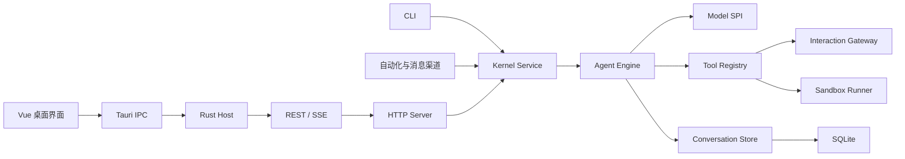

Foya 是一个开源、本地优先的个人 Agent 系统。它采用以 Go 内核为中心的模块化
单体架构：桌面端、CLI、自动化任务和消息渠道共享同一套 Agent Runtime，而不是
分别实现模型调用和工具执行逻辑。

本文只说明系统的整体结构。模型循环、上下文、工具和存储等主题在各自的技术
文档中展开。

## 设计目标

Foya 的整体架构围绕以下目标设计：

- **本地优先**：项目文件、会话记录和运行配置默认保存在用户设备上。
- **模型服务可替换**：Session 通过 Connection 和 Model 选择具体模型服务。
- **多入口共用内核**：桌面端、CLI、自动化和消息渠道遵守相同的运行规则。
- **事实可恢复**：完成的消息和关键状态变化进入持久化事件日志。
- **副作用受控制**：模型只能通过注册工具产生外部操作，工具受审批和沙箱约束。
- **传输与业务分离**：HTTP、SSE 和桌面 IPC 不包含 Agent 决策逻辑。

## 总体结构

从职责上看，系统可以分为五层：

| 层次 | 主要职责 |
|---|---|
| 客户端 | 展示状态、提交命令、响应审批和用户提问 |
| 传输层 | 在客户端与内核之间传输 REST 请求和 SSE 事件 |
| 应用服务 | 管理 Session、队列、连接、项目和跨模块工作流 |
| Agent Runtime | 组装上下文、请求模型、执行工具并推进回合 |
| 基础设施 | 持久化、模型协议、沙箱、文件和外部集成 |

## 桌面进程

桌面应用包含三个运行部分：

1. **Vue WebView** 渲染聊天、设置、审查和运行状态。
2. **Tauri Rust Host** 提供桌面 IPC、本机窗口以及浏览器等平台能力。
3. **Go Sidecar** 持有 Kernel Service、Agent Runtime 和持久状态。

桌面端默认通过用户私有目录中的 Unix Domain Socket 访问 Go Sidecar。Rust Host
负责把 Tauri Command 转换为 HTTP 请求，并将 SSE 事件转发给 WebView。

这种分层使界面不会直接操作数据库、模型凭证或工具进程。关闭某个界面不会改变
Session 的所有权；Session 属于 Go 内核。

## Go 内核

Go 内核是系统的组合根。启动时，它会创建并连接以下服务：

- Conversation Manager、Store 与 Project Manager
- Event Broker
- Agent Engine 与 SubAgent Manager
- Model SPI、OpenAI Adapter 与 Connection 管理
- Tool Registry、Interaction Gateway 和 Sandbox Runner
- Rules、Memory、Skills 与 MCP
- Artifact、Canvas、Workflow、Automation 和 Channel

组合根只负责建立依赖和控制关闭顺序。具体业务操作通过 Kernel Service 暴露。

## Kernel Service

Kernel Service 是与传输方式无关的应用服务入口。它负责：

- 创建、更新、分支和删除 Session；
- 串行调度同一 Session 中的用户消息；
- 管理 Project、Connection 和默认模型；
- 协调历史回退、文件审查和 Artifact 生命周期；
- 暴露 Rules、Memory、Skills、MCP 等能力；
- 将状态变化持久化并广播给客户端。

HTTP Server、CLI 和外部渠道调用的是同一个 Kernel Service，因此不会出现桌面端与
自动化任务行为不一致的第二套实现。

## Agent Runtime

Agent Engine 执行一次用户任务时，会重复以下过程：

1. 读取当前 Session 配置。
2. 编译本次模型请求所需的上下文。
3. 调用 Session 绑定的 Provider。
4. 消费文本、推理和工具调用流。
5. 执行模型请求的工具。
6. 把工具结果写入历史并再次调用模型。
7. 在模型停止、用户取消或运行保护触发时结束回合。

同一个 Session 同时只运行一个回合；不同 Session 可以并发运行。详细过程参见
[Agent Runtime](./agent-runtime.md)。

## 状态与事件

Foya 不把界面当前显示的对象当作唯一事实来源。完成的消息、工具状态、审批、
用量和历史操作会形成带序号的事件。

事件同时承担三种职责：

- 建立可审计的会话事实；
- 派生消息历史和其他读取视图；
- 向多个客户端同步状态变化。

高频流式文本只通过内存 Broker 发送，最终完成的消息才持久化。这样可以避免为
每个 Token 写数据库，同时仍能在重连后恢复完整消息。

详细的事件和投影规则参见[事件存储](./event-store.md)。

## 扩展边界

Foya 有四类主要扩展点：

| 扩展点 | 用途 | 权限边界 |
|---|---|---|
| Provider | 接入模型请求和可选模型能力 | 不授予 Tool 权限 |
| Tool / MCP | 提供可执行能力 | 调用经过审批；外部 MCP 仍受其部署环境约束 |
| Skill / Rule | 提供流程与行为约束 | 不能扩大 Session 权限 |
| Hook | 在生命周期节点运行本机命令 | 以宿主用户权限执行，属于受信任配置 |

模型可加载的扩展内容只能缩小或使用已有能力，不能绕过 Approval Gateway、
Sandbox 或内核配置。Hook 是例外：它不是模型工具，而是用户预先配置的宿主命令，
不会经过 Tool Approval 或 Sandbox。

## 信任边界

系统将输入分为不同权威级别：

- 内核静态指令定义基本运行规则。
- 用户配置的 Rules 定义期望行为，但不能削弱审批和沙箱。
- 项目说明、Skill 内容、网页和工具输出都按用户可控或外部数据处理。
- 模型输出只是下一步建议；只有通过工具执行边界才能产生副作用。

`full_access` 会同时跳过普通审批并放开工具的文件系统与网络限制，应只在用户明确
信任的环境中使用。

## 当前实现边界

- 内置语言模型接入以 OpenAI 兼容 Chat Completions 为主。
- macOS 使用 Seatbelt，Linux 使用 Bubblewrap。
- Windows 的桌面传输和受限执行能力尚未形成完整支持。
- 桌面端支持本地 Unix Socket、SSH 自动部署/隧道和带 Bearer Token 的 HTTPS。
- 远程服务仍是单实例、单租户模型，不支持水平扩容。
- 配置和业务数据分布在 SQLite 与若干本地文件中，尚未合并为单一事务存储。

这些边界描述的是当前实现，不代表扩展接口未来只能支持这些能力。
