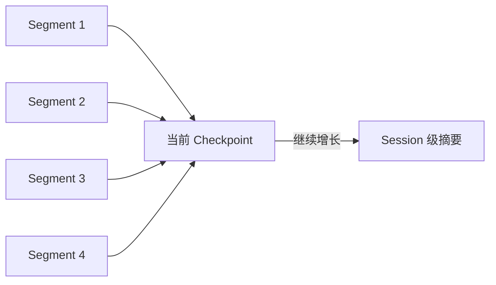

上下文压缩用于解决一个明确问题：Session 历史持续增长，但模型的上下文窗口有限。

Foya 不通过删除历史解决这个问题。它保留完整事件日志，并为模型生成更短、可验证
的历史投影。这份投影称为 Checkpoint。

## 设计原则

压缩过程遵循以下原则：

1. Canonical History 不因压缩而改变。
2. 只压缩连续且完整的历史前缀。
3. 当前用户请求和最近工作步骤优先保留原文。
4. Tool Call 与对应 Tool Result 不允许被拆开。
5. 候选 Checkpoint 必须通过结构、来源和大小校验。
6. 压缩失败时保留当前可用历史，不提交半成品。
7. Provider 是请求是否超出窗口的最终裁决者。

## 何时触发

压缩有三个入口：

| 入口 | 触发条件 |
|---|---|
| 预算触发 | Context Compiler 估算下一次输入超过高水位 |
| Provider 触发 | Provider 明确返回输入上下文过长 |
| 手动触发 | 用户在空闲 Session 中主动整理历史 |

一次 Turn 中的 Provider 溢出恢复最多自动使用一次，避免不可修复请求无限重试。

限流、配额不足和输出 Token 上限不属于输入上下文溢出，不会触发压缩。

## 安全边界

压缩计划根据运行位置选择不同边界。

### `pre_turn`

用于新用户回合开始后。Foya 压缩最新 User 消息之前的完整历史：

```text
压缩前：
旧回合 A + 旧回合 B + 当前 User

压缩后：
Checkpoint(A + B) + 当前 User
```

当前 User 消息保持原文。

### `mid_turn`

用于一个回合内部已经积累多次工具步骤的情况。Foya 可以覆盖当前 User 消息之后
已经完成的中间步骤，但会把当前 User 原文重新放入模型投影，并保留最新完整工作
步骤。

```text
Checkpoint(旧历史 + 当前回合已完成步骤)
+ 当前 User 原文
+ 最新工作步骤
```

只有当前 User 之后至少存在足够多的完整步骤时，`mid_turn` 才有压缩价值。

### `standalone`

用于用户手动压缩空闲 Session。它可以覆盖所有符合安全要求的有效历史。

### 原子工具组

Assistant 的 Tool Call 和紧随其后的 Tool Result 被视为一个原子组。缺少结果的
调用属于未完成组，不能进入被压缩前缀。

这项约束避免产生两类无效历史：

- 只保留工具调用，却没有执行结果；
- 只保留工具结果，却无法知道是谁发起的调用。

## Checkpoint V3

Checkpoint 不只是摘要文本。当前格式记录：

| 信息 | 用途 |
|---|---|
| Schema 与格式版本 | 确认读取方使用相同协议 |
| Checkpoint ID | 校验投影内容和血缘身份 |
| Previous Checkpoint ID | 防止并发或过期结果覆盖新状态 |
| Through Seq | 标记覆盖到哪个事件 |
| Source Digest | 校验被覆盖事件没有变化 |
| Head Anchor Seq | 记录需要重新插入的 User 消息 |
| Phase | 记录使用的安全边界类型 |
| Projection Kind | 区分文本与 Provider-native 状态 |
| Segments 与 Level | 描述分层摘要 |
| Provider Route | 约束原生状态的使用范围 |
| Token 估算 | 记录压缩前后的规模 |

Checkpoint ID 由协议版本、来源、血缘、投影内容、模型和 Route 等字段共同计算。
任一关键字段变化都会得到不同 ID。

Foya 只接受当前 Checkpoint V3。缺少版本、ID、Model、创建时间、投影类型或必要
Segment 的旧格式会被判定无效，不进行兼容迁移。

## 文本摘要格式

Portable Text Checkpoint 使用固定结构：

```text
## Goal
## Progress
## Key Decisions
## Next Steps
## Critical Context
```

这五个章节分别保存：

- 当前目标；
- 已完成工作与验证结果；
- 影响后续实现的重要决定；
- 尚未完成的下一步；
- 继续任务所必需的路径、约束、错误和事实。

生成后，Foya 会检查：

- 五个章节是否齐全且顺序正确；
- 每个章节是否有实际内容；
- Markdown 代码块是否闭合；
- 是否带有明显截断标记；
- Provider 是否因输出长度停止。

第一次候选不合格时，Foya 可以请求一次更短的修复版本。第二次仍失败则放弃本次
压缩。

## 分层 Segment

反复把“旧摘要 + 新历史”重写成一段新摘要，会让早期事实多次经过模型改写。

Foya 优先只总结新覆盖的历史，并把结果追加为 Segment：



当以下条件同时成立时，可以追加 Segment：

- 已有有效 Text Checkpoint；
- 新计划覆盖更后的事件；
- 当前 User Anchor 没有变化；
- Segment 数量少于四个。

达到四个 Segment，或者 Anchor 发生变化时，Foya 会生成覆盖整个前缀的 Session
级摘要。这样既减少重复改写，也限制投影本身无限增长。

## Compactor

压缩生成通过统一 Compactor 接口完成：

### Text Compactor

Text Compactor 调用支持详细非流式结果的 Provider，获得摘要、Finish Reason 和
Usage。它生成可跨兼容 Provider 使用的文本投影。

### Provider-native Compactor

Provider 可以选择实现原生压缩，返回不透明的 Context State。Foya 不解释其内部
结构，但会校验它是有效 JSON，并将其绑定到生成时的 Route。

Route 不匹配时，原生状态不会发送给另一个 Provider。若原生压缩不受支持或返回
无效结果，Runtime 可以回退到 Text Compactor。

当前内置 OpenAI 兼容 Provider 使用 Chat Completions，没有实现 Provider-native
Compaction。

## 候选验收

生成候选后，Foya 只在满足以下条件时提交：

1. 投影类型和必要字段合法；
2. 文本摘要通过固定格式校验；
3. Provider-native State 是合法 JSON；
4. 候选覆盖的事件摘要与当前历史一致；
5. Checkpoint 血缘仍指向当前 Checkpoint；
6. 文本投影的估算大小小于它所替换的有效投影。

最后一项比较的是“压缩前模型实际会看到的投影”，而不是所有原始历史的大小。
因此不会因为 Canonical History 很大，就接受一个比现有 Checkpoint 更大的新摘要。

## Accepted Boundary 退让

生成摘要本身也需要模型上下文。如果待压缩前缀太大，摘要请求可能先被 Provider
拒绝。

每次 Provider 成功处理普通请求后，Foya 按 Session 和 Route 保存：

- 已接受到的事件边界；
- 输入和输出 Token；
- 请求 Payload 大小。

压缩请求溢出时，Planner 可以把最大覆盖位置退让到该 Route 已经成功接收过的边界，
然后重新生成较小范围的 Checkpoint。

Accepted Boundary 会持久化，因此内核重启后仍可使用。它不会跨 Route 共享。

## 大型 Tool Result

单个 Tool Result 可能比整段普通对话更大。历史压缩无法解决仍在 Working Set 中的
巨大结果，因此 Foya 还会缩短模型可见表示：

1. 首先保留最新 Tool Result，压缩更早的大结果；
2. 如果压力仍然存在，再限制所有超大 Tool Result；
3. 保留原结果的开头和结尾；
4. 添加 Event Seq、Tool Call ID、SHA-256 和读取工具引用。

完整内容仍在 Canonical History。模型可以使用 `history_read_tool_result`：

| 操作 | 用途 |
|---|---|
| `inspect` | 查看摘要、长度和 Digest |
| `read` | 按 Rune Offset 分页读取 |
| `search` | 按不区分大小写的文字搜索行 |

读取时会验证当前 Session、有效事件、Tool Call ID 和可选 SHA-256，避免引用指向
已回退或变化的结果。

## 失败处理

压缩使用 fail-open 策略：压缩失败不会覆盖原始事件或现有有效 Checkpoint。

确定性失败会生成指纹，指纹包含 Prompt 版本、Route、父 Checkpoint、来源 Digest、
覆盖边界和 Anchor。相同来源重复失败后，Runtime 会抑制后续等价尝试，避免每个
Step 都花费 Token 重试。

每个 Session 最多缓存 16 个失败指纹。成功写入新 Checkpoint 后清空失败记录。

压缩过程会产生结构化诊断事件，记录 Trigger、Phase、Stage、Outcome、覆盖消息数
以及压缩前后估算大小。

## 持久化与恢复

Checkpoint 与 `compaction_completed` 事件在同一个 SQLite 事务中提交。

读取时，Conversation Store 会重新验证：

- Checkpoint 版本和 ID；
- Session 与来源 Digest；
- Through Seq 和 User Anchor；
- Segment 连续性；
- Projection Kind 和 Route 状态。

快速投影损坏时，可以从最近的有效完成事件恢复。若没有可恢复候选，无效投影会被
删除，并回退到有效 Canonical History。

历史回退后，只会考虑回退事件之后产生的 Checkpoint，防止旧投影跨越新的历史
边界。

## 当前边界

- 摘要仍是有损表示，不能保证保留原始历史的每个细节。
- 可恢复引用当前只覆盖 Tool Result，不提供任意消息全文检索。
- Text Compactor 使用当前 Session 的语言模型，不支持单独选择摘要模型。
- 内置 Provider 尚未启用原生压缩协议。
- Foya 不根据语义猜测某个工具结果“已经没用”并自动删除它。
