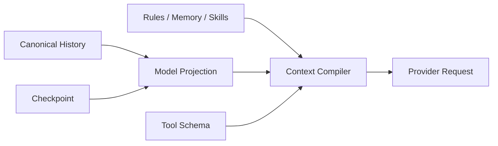

上下文是一次模型请求实际收到的全部输入。它不是 Session 的同义词，也不是模型
内部自动保留的记忆。

语言模型每次调用都是独立请求。为了让模型继续当前任务，Foya 必须在每个 Step
开始前重新选择并发送必要信息。

## 上下文包含什么

一次请求的上下文主要由以下部分组成：

| 内容 | 来源 | 作用 |
|---|---|---|
| 系统指令 | Foya 内核 | 定义 Agent 的基本行为和安全边界 |
| 项目说明 | `AGENTS.md` 等文件 | 提供仓库约定和工作方式 |
| Skills Catalog | 已启用 Skill 元数据 | 告知模型可以按需加载哪些流程 |
| Rules | 全局和项目规则 | 约束 Agent 应该怎样工作 |
| Memory | 全局和项目记忆 | 提供跨会话事实与偏好 |
| 环境信息 | 当前 Session | 提供工作目录、平台、时间和审批模式 |
| 历史投影 | Event Store | 提供当前会话已经发生的内容 |
| Tool Schema | Tool Registry | 描述本次允许调用的工具 |
| Provider State | 可选 Provider 能力 | 携带 Provider 原生的连续上下文 |

二进制图片只在请求物化阶段从 Artifact Store 读取，不会直接存入事件日志。

## 上下文不是什么

上下文与以下概念不同：

| 概念 | 区别 |
|---|---|
| Session History | 保存会话完整消息；上下文只选择本次请求需要的视图 |
| Memory | 跨 Session 保存的长期事实；上下文是一次请求的临时输入 |
| Rules | 用户定义的行为要求；Rules 只是上下文的一种来源 |
| Prompt | 通常指指令文本；上下文还包含消息、工具定义、图片和原生状态 |
| 模型训练数据 | 模型已有知识；Foya 无法通过上下文永久修改模型 |

关闭窗口、切换界面或等待一段时间不会让模型自动记住更多内容。只有被 Foya
重新放入下一次请求的信息，模型才能直接使用。

## 两种历史

Foya 同时维护完整历史和模型历史。

### Canonical History

Canonical History 来自不可变事件日志，保存完成的：

- User 消息；
- Assistant 消息；
- Tool Call；
- Tool Result；
- 从其他 Session 导入的消息。

它是历史事实来源。上下文管理不会为了节省 Token 删除这些消息。

### Model Projection

Model Projection 是为当前模型请求生成的历史视图。它可能是：

```text
Checkpoint
+ 当前用户原始请求
+ 最近的 Assistant 与 Tool 消息
```

也可能在没有有效 Checkpoint 时直接使用全部有效消息。

Projection 可以重新生成。Checkpoint 无效、Route 不匹配或投影损坏时，Foya 会
回退到 Canonical History。



## 系统提示词的组装顺序

Foya 按稳定顺序组装系统提示词：

1. 内核静态前缀；
2. 用户全局目录和 Project 中的说明文件；
3. Skill Catalog；
4. 当前直接生效的 Rules；
5. 可由模型按需加载的 Rule Index；
6. 审批模式说明；
7. 当前有效的 Memory；
8. 工作目录、平台、Shell 和时间。

稳定前缀放在最前面有利于 Provider 使用 Prompt Cache。用户可控内容会标记来源和
权威边界，不能覆盖系统安全、审批或沙箱策略。

项目说明支持 `AGENTS.md`、`CLAUDE.md` 和 `GEMINI.md`。Foya 会清理控制字符、
按内容去重并限制单文件和总长度。

## 每个 Step 都重新编译

Context Compiler 在每次模型调用前运行，而不是只在 Turn 开始时运行。这样可以
立即包含：

- 刚完成的 Tool Result；
- 当前 Step 激活的 Deferred Tool；
- 根据活动内容匹配的新 Rule；
- 新生成的 Compaction Checkpoint；
- Provider 上一轮返回的真实 Usage。

编译器返回一个不可变请求视图，包括消息、工具、可选 Provider State、当前事件
边界和预算判断。

## 内容分层

为了识别压力来源，编译器把请求分成五层：

| 层次 | 典型内容 | 默认处理 |
|---|---|---|
| Pinned | 系统指令和持久上下文 | 优先保留 |
| History | 当前用户请求之前的历史 | 可以压缩 |
| Working Set | 最新 User 消息及其后的步骤 | 优先保持原文 |
| Tool Schema | 当前可调用工具的定义 | Deferred Tool 按需加载 |
| Native State | Provider 原生上下文状态 | 仅在匹配 Route 使用 |

分层不会直接删除内容，它用于诊断当前压力主要来自历史、当前工作集还是固定开销。

## Token 预算

上下文窗口必须同时容纳输入和模型输出。Foya 因此不会把整个窗口都分配给历史。

已知模型窗口时：

- 首次请求默认保留窗口的四分之一作为输出空间；
- 初始保留最多为 16K Token；
- 获得真实 Usage 后，按上一轮输出的两倍动态保留；
- 动态保留限制在 1K 到 8K Token；
- 如果模型配置了更小的最大输入 Token，则使用更严格的上限。

不知道模型窗口时，Foya 使用保守预算：

```text
历史高水位：32K Token
输出保留：约 16K Token
```

这些值是本地调度参数，不代表 Provider 一定具有相同限制。

## 如何估算下一次请求

不同模型对中文、代码和 JSON 的 Token 切分不同，本地字符估算不可能完全准确。

Foya 优先使用 Provider 上一次返回的真实输入 Token，然后计算请求 Payload 相比
上一轮增加或减少的大小，把差值应用到真实基线上。

只有缺少真实 Usage 时，才对完整 Payload 使用保守字符权重估算。估算范围包括：

- 所有模型可见消息；
- Tool Schema；
- Provider 原生状态；
- 附件的估算开销。

本地估算只负责决定是否提前整理上下文。即使估算仍高于预算，Foya 也会让 Provider
作最终容量判断，而不会仅凭估算拒绝请求。

## Tool Schema

工具定义本身也占用上下文。

Tool Registry 将工具分为：

- `direct`：每次请求直接可见；
- `deferred`：通过 `tool_search` 激活后，在下一 Step 可见；
- `hidden`：不暴露给模型。

大型工具集合无需在每次请求中发送全部 Schema。Deferred Tool 的激活状态只影响
当前 Turn，不永久修改注册表。

当历史投影包含大型 Tool Result 引用时，Foya 会自动加入
`history_read_tool_result`，使模型能够检查、分页读取或搜索原始结果。

## 图片与结构化输入

历史中只保存 Attachment 引用。向 Provider 发请求时，Foya 才从当前 Session 的
Artifact Store 读取图片字节，并检查：

- 当前模型是否声明支持图片输入；
- Artifact 是否仍然存在；
- 单次请求的图片总量是否超过限制。

不支持或不可用的图片会转换成明确的文本说明，不会伪装成成功传入的视觉内容。

用户选择的浏览器元素以结构化数据保存在消息中，并在 Provider 视图中标记为不可信
页面内容。

## Route 隔离

上下文预算基线和 Provider 原生状态都绑定具体 Route。Route 由 Connection、协议、
端点和 Model 等稳定信息派生。

切换模型或连接后：

- 不复用旧 Route 的真实 Token 基线；
- 不重放旧 Route 的 Provider-native State；
- Portable Text Checkpoint 仍可在通过来源校验后使用。

这可以避免不同模型的容量和协议状态相互污染。

## 与其他机制的关系

- 历史接近预算时，由[上下文压缩](./compaction.md)生成更短投影。
- 跨会话事实由[记忆](./memory.md)提供。
- 行为约束由[规则](./rules.md)提供。
- Tool Schema 和调用过程参见[工具系统](./tools.md)。

## 当前边界

- Token 数量是近似值，最终限制由 Provider 决定。
- 内置 OpenAI 连接使用 Chat Completions，没有启用原生上下文继续状态。
- 当前 Working Set 以最新 User 消息为主要边界，不进行任意语义删除。
- 项目说明、Rules、Memory 和 Skill Catalog 都有独立长度上限。
- Foya 不把模型推理文本作为普通后续上下文反复发送，取消回合的显式保留除外。
