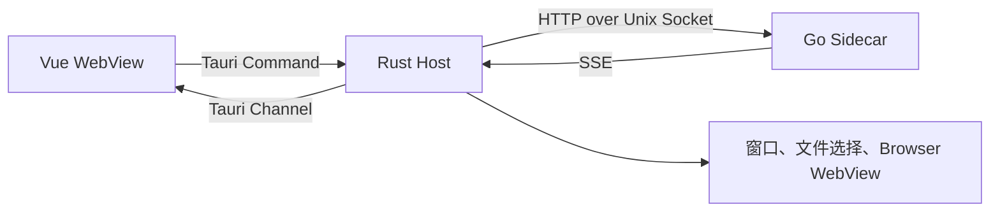

Foya 桌面应用由 Vue、Tauri 和 Go 三个运行层组成。界面不直接持有 Agent Runtime；
Go Sidecar 才是 Session、工具和持久状态的所有者。

## 三层结构



### Vue WebView

负责：

- 路由和页面渲染；
- Session、Message 和 Tool 状态投影；
- 输入、审批、提问和文件审查交互；
- 设置管理；
- Workbar、Terminal、Browser 和 Canvas 界面。

### Rust Host

负责：

- 启动和监管 Go Sidecar；
- 连接 Unix Domain Socket、SSH 隧道或 HTTPS 远程内核；
- 探测 SSH 主机并自动部署匹配架构的 Linux 内核；
- 把 Tauri Command 转成 REST；
- 把 SSE 帧转发到 WebView；
- 处理原生文件选择和外部编辑器；
- 创建与控制 Browser WebView。

### Go Sidecar

负责：

- 所有业务规则；
- Agent Runtime；
- Provider 与工具；
- 权限和沙箱；
- Session 与持久状态；
- 外部 Channel 和 Automation。

## Sidecar 启动

Tauri 启动时选择当前平台对应的 Sidecar 二进制，并设置父进程 ID。Go Kernel 根据
父进程生命周期退出，避免桌面窗口关闭后长期留下孤立服务。

开发和打包前，Makefile 会按 Tauri Target Triple 生成 Sidecar：

```text
foya-aarch64-apple-darwin
foya-x86_64-apple-darwin
foya-x86_64-unknown-linux-gnu
foya-x86_64-pc-windows-msvc.exe
```

正式 App 不内置远程内核。首次使用 SSH 连接时，Rust Host 会从同版本 GitHub
Release 下载匹配架构的 gzip 内核，校验 SHA-256 和 ELF 后写入版本化缓存；后续
部署复用缓存。开发模式仍会在本地生成 `linux/amd64` 和 `linux/arm64` 内核。

桌面进程会转发必要的 `FOYA_PROVIDER_*` 环境变量给 Sidecar。

## 内核连接模式

设置页支持三种模式：

- **本机**：启动并连接打包的 Sidecar；
- **SSH**：复用系统 OpenSSH 配置，上传内核并维护本地端口转发；
- **HTTPS**：连接已经部署并配置 Bearer Token 的远程内核。

SSH 和 HTTPS 模式不会启动本地 Sidecar。连接配置保存在桌面应用配置目录的
`kernel-connection.json`，原始访问令牌不会由远端内核保存。

## Command Bridge

Vue 的 API 层集中调用 Tauri Command。Rust Command 再调用 Go HTTP API。

这种两段桥接提供：

- 统一错误转换；
- 二进制上传和下载；
- 平台路径处理；
- 持续事件 Channel；
- 避免 Vue 直接依赖 Socket 实现。

业务组件不应自行拼接 Kernel URL。所有内核调用应集中在 API 层。

## 前端状态

`useKernel` 维护应用级共享状态：

- Session 与 Project 列表；
- 每个 Session 的 Message Bucket；
- 运行、压缩和队列状态；
- Usage；
- SubAgent 与 Workflow；
- 文件审查；
- 等待中的 Approval、Question 和 Browser Action；
- 后台命令。

切换当前 Session 不会停止其他 Session。每个 Session 的消息和运行标记按 ID
分别保存。

## 事件投影

前端通过 SSE 更新本地视图：

- Delta 追加到当前流式 Assistant Message；
- `message_end` 用持久结果收敛临时内容；
- Tool Event 更新 Assistant Message 内的 Tool Segment；
- `turn_complete` 清理流式状态；
- Session Delete 阻止迟到事件重新建立数据桶。

UI 中的 Message Segment 保存“推理 → 文本 → 工具 → 推理”的显示顺序，但它是
客户端视图，不是 Kernel Canonical Message 的替代品。

首次打开 Session 时，前端先读取 History，再建立订阅。Child Session 在
SubAgent 状态出现后按需加载并订阅。

## 路由

桌面端使用 Hash Router，主要区域包括：

- Chat；
- Studio；
- Automations；
- Settings。

Settings 再按 Connection、Default Model、Rules、Memory、Skills、Commands、
Hooks、MCP、Web Search、Channel、Agent、Usage 和 Appearance 分页。

Hash Router 避免桌面静态资源加载依赖服务端 History Fallback。

## Browser WebView

Browser 不在普通 Vue DOM 中模拟。Rust Host 创建独立 WebView，并负责：

- 导航和窗口位置；
- 页面 Snapshot；
- 元素选择；
- 点击、输入和滚动；
- 截图；
- 把执行结果返回 Go Browser Controller。

Agent 发出的 Browser Action 仍通过 Kernel Event 和 Tool 生命周期协调。

## Project Files 与 Terminal

Project File Explorer 的本机文件操作由 Rust Command 提供。Interactive Terminal
则由 Go Kernel 的 Terminal Manager 创建和持有 PTY、输出 Buffer、Replay Seq 与
进程生命周期；Rust/Tauri Command 只负责把 WebView 请求和输出流桥接到内核。

Terminal 输出通过独立 Channel 流式返回。关闭 Session 时，Go Kernel 会停止对应
Terminal 和后台命令。

## 故障收敛

桌面端把 Kernel 持久快照视为恢复依据：

- 流中断后可重新读取 Session History；
- 最终 `message_end` 覆盖不完整 Delta；
- 删除集合过滤迟到事件；
- 队列、Usage 和 File Review 可以重新通过 REST 获取。

前端状态不应成为唯一持久来源。

## 当前边界

- macOS 和 Linux 是当前主要桌面目标。
- Windows 存在构建目标，但 Unix Socket 桥接和部分本机能力尚未完整实现。
- 远程 Kernel 中的项目路径属于服务器；本机 Project File Explorer 不会自动浏览
  服务器文件系统。
- 前端事件投影与 Go 协议类型需要在同一仓库同步演进。
