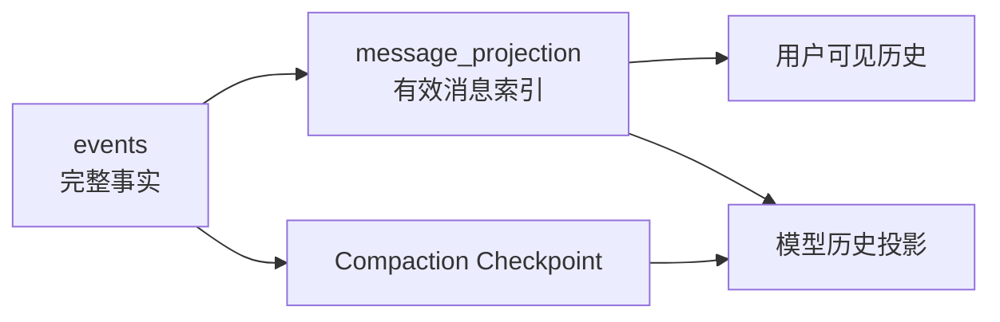

Foya 使用事件日志保存会话中已经发生的事实，并从事件派生适合不同用途的读取
视图。事件日志、消息投影和实时事件总线共同组成状态系统，但三者职责不同。

本文聚焦会话状态。SQLite 的完整存储布局参见[数据存储](./storage.md)。

## 为什么使用事件

Agent 的一次回合不只是最终回答，还可能包含：

- 用户消息；
- 多次模型响应；
- 工具调用和工具结果；
- 审批请求和决策；
- Token Usage；
- 上下文压缩；
- 取消、错误和完成状态；
- 历史回退和文件恢复。

如果只保存界面最后显示的消息，这些过程无法可靠恢复，也难以让多个客户端保持
一致。Foya 因此把关键变化记录为按序排列的 Event。

## Event 结构

每个持久化 Event 都包含：

| 字段 | 含义 |
|---|---|
| `seq` | 数据库分配的单调递增序号 |
| `kind` | 事件类型 |
| `session` | 所属 Session |
| `run_id` | 可选的 Turn 运行身份 |
| `time` | 发生时间 |
| `payload` | 由事件类型决定的数据 |

`seq` 是事件的稳定顺序依据。客户端重连、历史读取和投影更新都依赖序号，而不是
依赖客户端接收时间。

## Canonical Event Log

Canonical Event Log 是会话事实来源。完成的用户、Assistant 和 Tool 消息会以
`message_end` 事件保存。

上下文压缩不会改写这些消息。历史回退也不会物理删除旧消息，而是追加
`history_rewound` 事件并更新有效消息投影。

这种方式带来三个重要性质：

1. 模型上下文可以被压缩，而用户历史仍保持完整。
2. 投影损坏时可以从事件重新计算。
3. 历史操作有明确的发生顺序和审计依据。

Session 被用户永久删除时是例外：其事件和相关投影会被清理。

## 持久事件与实时增量

并非所有界面更新都写入 SQLite。

| 数据 | 处理方式 |
|---|---|
| 完成消息 | 写入事件日志 |
| 工具开始、结束 | 写入事件日志并广播 |
| 审批和回合状态 | 写入事件日志并广播 |
| Usage 和 Compaction | 写入事件日志并更新专用投影 |
| 文本与推理 Delta | 仅通过内存 Broker 广播 |

模型流式输出可能包含大量小片段。逐片写数据库会增加写放大，因此 Foya 只实时
广播 Delta，并在生成结束时保存聚合后的完整消息。

如果客户端错过了部分 Delta，它仍可以通过最终 `message_end` 恢复一致内容。

## 消息投影

`message_projection` 是事件日志上的可重建索引，用于快速读取当前有效消息。
它记录消息事件属于哪个 Session，以及该消息当前是否有效。

普通历史读取只返回有效消息。模型历史还会叠加经过校验的 Compaction Checkpoint，
形成更短的模型输入。

投影不是独立事实。投影与事件冲突时，以事件及其校验结果为准。

## 原子写入

事件追加在 SQLite 事务中完成。根据事件种类，同一事务还会更新相应投影：

- 消息事件更新 `message_projection`；
- Usage 更新请求记录和日聚合 Ledger；
- Compaction 完成事件更新 Checkpoint 投影；
- Context Accepted 事件更新 Route 对应的已接收边界；
- 文件工具结果更新文件变化和内容 Blob 引用。

事件和对应投影要么一起提交，要么一起失败，避免出现“事件已经完成，但读取视图
仍停留在旧状态”的中间结果。

## 历史回退

历史回退是一个新的事实，而不是删除旧事实。

回退确认后，Conversation Store：

1. 校验目标 User 消息仍然有效；
2. 校验预览时记录的历史头没有变化；
3. 将目标消息及后续消息标记为非活动；
4. 写入 `history_rewound` 事件；
5. 使越过新边界的 Checkpoint 和 Accepted Boundary 失效。

后续读取只返回新的有效前缀。旧消息仍存在于事件日志中，但不再属于当前会话
分支。

文件回退使用单独的持久 Journal，避免应用在恢复多个文件过程中退出后留下无法
判断的半完成状态。

## Session 分支

分支不会让两个 Session 共享同一组事件。Conversation Store 会：

1. 在新 Session 中写入 `session_forked`；
2. 把选定的有效消息复制为 `message_imported`；
3. 为导入消息分配新的事件序号。

因此源 Session 后续回退、删除或继续运行，不会改变分支 Session 的历史。

## Checkpoint 恢复

Compaction Checkpoint 同时存在于：

- `compaction_completed` 事件的 Payload；
- `compaction_checkpoints` 快速读取投影。

加载模型上下文时，Conversation Store 会校验 Checkpoint 的版本、ID、来源摘要和覆盖
边界。

如果快速投影缺失、损坏或无法解码，Store 会查找最近一次有效的
`compaction_completed` 事件并重建投影。若事件中的候选也无法通过当前校验，
无效投影会被删除，模型历史回退为当前有效的原始消息。

Foya 不迁移旧 Checkpoint 格式；只有当前格式且通过完整校验的 Checkpoint 才能
进入模型投影。

## Accepted Boundary

当 Provider 成功接收一次请求后，Foya 会记录该 Provider Route 实际接收过的
历史边界和 Usage。

这项记录用于：

- 为下一次请求提供真实 Token 基线；
- 在压缩请求本身过长时退让到已验证边界；
- 避免一个模型连接的容量经验污染另一个连接。

Accepted Boundary 按 Session 与 Route 隔离。历史回退会使超出新历史范围的记录
失效。

## 事件分发

内存 Broker 按 Topic 向多个订阅者广播事件。

- 高频 Delta 使用有损投递：慢客户端不能阻塞 Agent。
- 完成消息、审批和回合结束等关键事件使用有界等待的必达投递。

“必达”表示内核会等待一个有限时间尝试发送，而不是无限阻塞整个 Agent。持久化
事件仍是客户端恢复状态的最终依据。

SSE 使用事件序号作为 ID。客户端可以携带最后收到的序号读取后续持久事件，然后
继续订阅实时流。

## 删除边界

删除 Session 时，Conversation Store 会先记录删除标记，再清理：

- Event；
- 消息投影；
- Usage 明细；
- Compaction Checkpoint；
- Accepted Boundary；
- Stream Snapshot；
- 文件变化和回退 Journal。

删除标记会阻止已经失去 Session 所有权的迟到任务重新追加事件。

聚合后的 Usage Ledger 与 Session 明细分离，可以在删除 Session 后继续提供总体
统计。

## 一致性原则

Foya 的状态系统遵循以下规则：

- Event 表达已经发生的事实。
- Projection 负责提高读取效率，可以重建。
- 实时 Delta 负责交互体验，不承担最终恢复。
- 历史修改通过新事件表达，不直接伪造旧事实。
- 外部文件副作用使用额外校验和 Journal，不能只依赖数据库事件。

## 当前边界

- Event 序号由共享数据库分配，是全局递增而不是每个 Session 从 1 开始。
- 流式 Delta 不持久化，进程退出后只能恢复最终完成消息。
- 内存队列和等待中的审批不属于可恢复事件投影。
- Session 永久删除会删除其明细事件，事件日志不是无限期归档系统。
