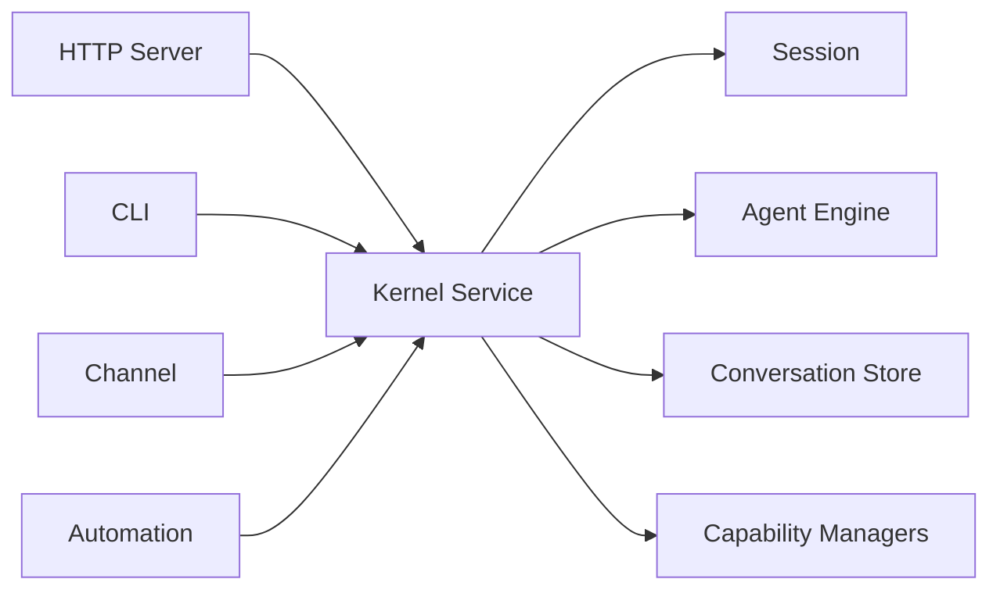

Foya 的 Go 内核在同一个 `kernel` 包中保留两个明确层次：

- **`kernel.App`** 是组合根，负责创建服务、连接依赖和管理进程生命周期。
- **`kernel.Service`** 是应用服务门面，负责校验请求并协调多个领域模块。

两者都不负责界面渲染，也不把具体 Provider 协议或工具实现写进业务流程。

## Kernel

内核启动时按依赖顺序创建：

1. 配置和 SQLite Database；
2. Conversation Manager 与 Store；
3. Event Broker；
4. Interaction Gateway 和 Browser Controller；
5. Sandbox、Terminal 与 Tool Registry；
6. Skills、MCP、Rules、Memory 和 Project；
7. Model Adapter 与 Agent Engine；
8. SubAgent、Workflow、Automation 和 Channel；
9. Kernel Service 与 HTTP Server。

初始化任一步失败时，已经创建的资源会按逆序释放，避免留下部分运行的集成或数据库
连接。

## 组合而非业务

Kernel 负责回答“哪个实现连接到哪个接口”，例如：

- Agent Engine 使用哪个 Conversation Store；
- Tool Registry 注册哪些内置 Tool；
- Approval Gateway 把事件写到哪里；
- Kernel Service 如何解析 Session 的 Provider；
- Memory Maintenance 使用哪个模型；
- MCP Tool 注册到哪个 Registry。

实际创建 Session、提交 Turn 或修改 Connection 的规则不写在 Kernel 中，而由
对应 Manager 或 Kernel Service 实现。

## Kernel Service

Kernel Service 为所有入口提供统一业务语义：

主要职责包括：

- Session、Project 和 Connection 管理；
- Turn 队列和互斥调度；
- 历史分支、回退和文件审查；
- Artifact 与 Canvas 生命周期；
- Rules、Memory、Skills、MCP、Hooks 和 Commands；
- SubAgent、Workflow、Automation 和 Channel；
- 业务结果持久化与事件广播。

传输层只负责解析请求和编码响应，不直接修改这些状态。

## Manager 边界

持久领域通常由独立 Manager 或 Store 管理，例如 Project、Conversation、Skill、
Workflow 和 Automation。Kernel Service 不复制它们的数据结构，而是执行跨模块协调。

例如删除 Project 时，Kernel Service 会先找出关联 Session，通过 Session 删除流程清理
运行态和持久数据，最后再删除 Project Catalog 记录。

## Provider 解析

Kernel Service 保存 Connection Catalog 和已经创建的 Provider Client。Agent Engine
请求模型时，根据 Session 的 `connection_id` 解析 Provider。

同时，Kernel Service 向 Engine 提供：

- Model Context Window；
- 输入与输出 Token 限制；
- 图片输入能力；
- 稳定 Model Route；
- Fast Model。

Connection 更新后会重建 Provider Client，并使 Session 的内存预算基线失效。

## Session 调度

Kernel Service 的 Turn Scheduler 按 Session 隔离：

- 一个 Session 最多一个活跃 Turn；
- 后续输入进入 FIFO Queue；
- 独立 Compaction 与 Turn 互斥；
- Session 删除会阻止新任务并等待当前任务收尾；
- Turn 结束后自动派发下一条队列消息。

调度状态位于内存，完成消息和生命周期结果位于 Event Store。

## 能力装配

Tool Registry 在启动时注册内置能力，包括：

- 文件读取与修改；
- Shell 和后台命令；
- 用户提问与 Session Tasks；
- Rules、Memory 和 Skills；
- Web Search 与 Fetch；
- Browser 和 Canvas；
- MCP 控制与动态 Tool；
- SubAgent 调度。

可选 Manager 不存在时，Kernel Service 返回明确的 Unavailable 错误，不构造空结果伪装
为成功。

## 后台服务

Kernel 还启动以下长生命周期任务：

- MCP 连接管理；
- Automation Cron Scheduler；
- Feishu Channel；
- Memory Maintenance；
- Browser Controller；
- 后台命令监控。

它们共享 Kernel 根 Context。应用关闭时先取消 Context，再关闭外部连接和数据库。

## 失败恢复

Kernel 初始化数据库后、对外服务前执行：

- 中断文件回退恢复；
- 过期 File Change 清理；
- Session Phase 重置；
- SubAgent 未完成运行标记；
- Canvas 未完成生成标记。

不会自动重放 Provider 请求或工具调用，因为无法可靠判断外部副作用是否已经发生。

## 当前边界

- Kernel 是单进程组合根，不支持插件式热替换全部服务。
- Kernel Service 面向单用户实例设计，可通过本机、SSH 隧道或 HTTPS 访问。
- 同一数据目录不应由多个 Kernel 进程并发拥有。
- 远程模式不是多租户隔离环境，也不支持水平扩容。
- 一些 Manager 使用 SQLite，另一些使用独立 JSON 或 Markdown 文件。
