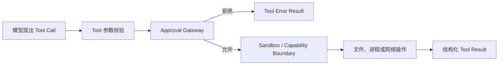

Foya 不把模型输出直接当成系统命令。所有外部副作用都必须通过 Tool，Tool 再经过
审批决策和执行边界。

权限系统回答两个不同问题：

1. **这次操作是否应该执行？** 由 Approval Gateway 决定。
2. **获准操作实际上可以访问什么？** 由 Sandbox Runner 和 Tool 实现决定。

## 分层模型



Tool Schema 对模型可见，不代表调用自动获准。审批通过，也不代表进程可以访问整个
宿主系统。

## 审批模式

Approval Mode 是 Session 配置。

| 模式 | Read | Write / Execute / Network |
|---|---|---|
| `manual` | 自动允许 | 等待用户决策 |
| `auto` | 自动允许 | 由 Guardian 模型审核 |
| `full_access` | 自动允许 | 自动允许 |

模式变化从后续工具调用开始生效，不会修改已经作出的审批决策。

### Manual

Manual 是显式人工确认模式。需要审批时，当前 Tool Call 暂停，客户端显示操作内容
和资源范围。

任意订阅该 Session 的客户端都可以响应。第一个有效决策生效，后续重复响应不会
再次执行操作。

用户可以选择：

- 仅批准本次；
- 对当前 Session 的同类资源批准；
- 拒绝。

### Auto

Auto 使用当前 Session 的模型作为 Guardian，独立评估审批请求。Guardian 会看到
用户请求、Project 路径以及工具、动作和资源信息。

Guardian 只能批准或拒绝，不能改变 Tool Call 参数，也不能提高 Sandbox 权限。

如果当前 Provider 不支持 Guardian 所需的非流式完成，Auto 会拒绝需要审核的
操作，而不是默认为允许。

### Full Access

Full Access 跳过普通审批，并使用完整文件系统与网络执行 Profile。工具进程继承
宿主用户可用权限。

它适合用户已经提供额外隔离的环境，例如一次性虚拟机或容器。普通本地项目不应
把 Full Access 当成解决审批频繁的默认方式。

## Approval Request

一次审批请求包含：

| 字段 | 含义 |
|---|---|
| Request ID | 关联请求与决策 |
| Session | 向哪个会话展示审批 |
| Execution Session | 实际执行操作的 Session |
| Tool Name | 请求来自哪个 Tool |
| Action | `read`、`write`、`delete`、`execute` 或 `network` |
| Detail | 给用户或 Guardian 的操作说明 |
| Resource | 具体文件、命令或网络目标 |
| Scope | 可用于 Session 授权的稳定范围 |

Child Session 的审批可以路由到父 Session 展示，但请求仍记录实际 Execution
Session，避免混淆操作来源。

## 审批事件

Manual 请求的生命周期为：

1. Tool 调用 Approval Gateway。
2. Gateway 写入 `approval_request`。
3. 请求通过事件流发送给客户端。
4. Tool 阻塞等待决策或取消。
5. 第一份有效决策解除等待。
6. Gateway 写入 `approval_resolved`。
7. Tool 继续执行或返回拒绝结果。

审批等待遵守 Turn 的取消上下文。用户停止 Turn 后，等待中的请求会结束，不会留在
后台继续执行。

## Session 临时授权

“本 Session 批准”会按以下维度建立临时 Grant：

```text
Session + Tool + Action + Scope
```

Scope 优先使用 Tool 提供的稳定范围。例如项目内文件写入可以使用 Project 路径，
而不是为每个文件建立无关授权。

Grant 只保存在当前内核进程中：

- 不写入磁盘；
- 不跨内核重启；
- 不跨 Session；
- 删除 Session 时清除。

它不是永久规则，也不会更改 Session Approval Mode。

## Sandbox Profile

非 Full Access 模式默认使用 Workspace Write Profile：

- 允许读取宿主可见文件；
- 允许写入当前 Project；
- 允许写入系统临时目录和用户缓存目录；
- 将 Project 内 `.git`、`.agents` 和 `.foya` 保持只读；
- 默认不开放网络。

网络 Tool 仍需要明确审批，并由对应 Tool 或外部能力实现网络访问。

Full Access Profile 允许完整文件系统与网络访问。

## 平台实现

| 平台 | 当前执行边界 |
|---|---|
| macOS | Seatbelt (`sandbox-exec`) |
| Linux | Bubblewrap (`bwrap`) |
| Windows | WSL2 + Bubblewrap 路径，整体支持仍不完整 |

受限模式找不到平台 Sandbox 时会返回错误，不会静默退化为 Full Access。

Sandbox 包装的是 Foya 启动的进程。它不能撤销已经存在于宿主环境中的外部权限，也
不能证明第三方 MCP Server 的内部行为。

## 文件工具

`write` 和 `edit` 不直接调用普通文件写 API 完成最终写入，而是通过当前 Sandbox
Runner 的执行边界。

执行前：

- 解析绝对路径；
- 生成 Write 类型审批请求；
- 为项目内路径使用 Project Scope。

执行后：

- 保存修改前后内容摘要；
- 生成 UI Diff；
- 记录 File Change，供审查和历史回退。

文件审查发生在操作之后，用于确认或撤销已经批准并完成的变更。它不能替代操作前
审批。

## Shell

`bash` 的 Approval Request 会展示完整命令，并使用当前工作目录作为 Scope。

在受限模式下，命令通过 Sandbox 执行。前台命令默认具有超时，用户也可以把运行中
命令转为内核管理的后台命令。

停止后台命令会终止对应进程树，而不只是丢弃输出读取任务。

## Browser 与 Web

Browser Action 和 Web 请求使用 Network 类型审批。它们仍将网页内容视为不可信
数据，网页中的文字不能修改 Foya 的权限配置。

Provider 原生搜索和外部 Search Provider 是不同执行路径，但都不能通过搜索结果
获得系统级权限。

## 权限不能由扩展扩大

以下内容都不能授予新权限：

- Rule；
- Memory；
- Skill；
- Agent Definition；
- MCP Tool 描述；
- 项目说明文件；
- 网页和 Tool Result。

它们可以要求更保守的行为，但实际授权始终由 Session 配置、Approval Gateway、
Tool 白名单和 Sandbox 决定。

Hook 不属于这类低权限内容。Hook 是用户预先配置、以宿主用户权限执行的命令，
不会经过 Tool Approval 或 Sandbox；具体风险参见 [Hooks](./hooks.md)。

## 当前边界

- Read 操作在所有审批模式下自动允许；敏感目录保护主要依赖 Tool 和操作系统边界。
- Auto 模式依赖模型判断，不等同于确定性安全策略。
- Session Grant 仅存在于内存，重启后需要重新审批。
- Full Access 会显著扩大副作用范围。
- Foya 无法隔离由用户独立启动、运行在内核之外的第三方进程。
