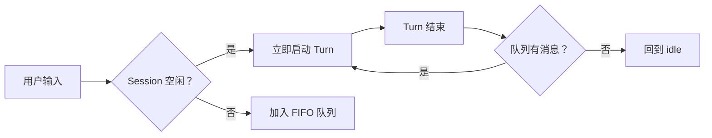

Session 是 Foya 中一次长期协作的身份边界。它把对话历史、模型选择、工作目录和
权限配置关联在一起，并为客户端、Agent Runtime 和持久化层提供稳定 ID。

Session 不等同于一次模型请求。一个 Session 可以包含多个用户回合，每个回合又
可以包含多次模型调用和工具执行。

## Session 保存什么

一个普通 Session 保存以下元数据：

| 字段 | 作用 |
|---|---|
| ID | Session 的稳定身份 |
| Connection 与 Model | 选择语言模型服务 |
| Reasoning Effort | 覆盖模型的推理强度 |
| Project ID | 绑定工作目录及项目级上下文 |
| Approval Mode | 控制工具审批策略 |
| Title | 用户可见名称 |
| Phase | 当前是否空闲、运行或压缩 |
| Agent Mode | 执行、规划或等待确认状态 |
| Tasks | 当前会话内的任务列表 |

标题和置顶状态属于组织信息，不参与模型推理。模型连接、Project 和审批模式会直接
影响后续回合。

## Project 绑定

Session 可以绑定一个 Project。Project 为 Session 提供：

- 默认工作目录；
- 项目级 Rules、Memory、Skills 和 Agent Definition；
- 文件工具和终端命令的作用范围。

Session 一旦绑定非空 Project，就不能切换或解除绑定。这个限制避免长期历史中的
路径、规则和文件副作用突然指向另一个目录。需要在其他目录继续时，应创建新
Session。

Project 只保存目录引用。删除 Project 会清理 Foya 中绑定的数据，但不会删除实际
项目目录。

## 执行阶段

Session 的 `phase` 表示内核当前正在做什么：

| Phase | 含义 |
|---|---|
| `idle` | 没有正在运行的 Turn 或压缩任务 |
| `turn` | 正在执行用户回合 |
| `compaction` | 正在执行独立上下文压缩 |

阶段由内核维护，客户端不能把 Session 任意标记为运行中。内核启动时会将持久化
Session 的阶段重置为 `idle`，因为上一次进程中的 goroutine 不可能跨重启继续。

Agent Mode 与 Phase 是两个不同概念。Phase 描述当前运行状态，Agent Mode 描述
允许 Agent 如何工作，例如执行模式或规划模式。

## 消息调度

同一 Session 同时只能运行一个 Turn。Kernel Service 为每个 Session 维护独立 FIFO 队列：

队列中的消息可以调整顺序、修改或删除。用户停止当前 Turn 时，可以选择保留队列，
也可以中断后派发指定消息。

队列属于进程内调度状态。客户端会收到队列快照事件，但内核重启后不会从历史事件
恢复尚未发送的队列项。

## 模型与权限更新

Connection、Model、Reasoning Effort 和 Approval Mode 是 Session 级配置。
修改后，下一次模型请求或工具调用会使用新值。

运行中的单次 Provider 请求不会在中途切换模型。配置变化在下一个模型 Step
重新编译上下文时生效。

Project 绑定是例外：非空绑定一旦建立便不可修改。

## 会话历史

客户端看到的历史来自当前有效消息投影，包括：

- 用户消息；
- Assistant 完成消息；
- Assistant 发起的工具调用；
- 对应的 Tool 结果；
- 从其他 Session 分支导入的消息。

流式 Delta 不是独立历史消息。只有聚合完成的消息会成为可恢复的会话内容。

上下文压缩不会删除 Session 历史。它只改变后续模型请求所使用的历史投影，详情
参见[上下文压缩](./compaction.md)。

## 分支

分支会创建一个新的顶层 Session，并复制源 Session 在指定边界之前的有效消息。
新 Session 拥有独立 ID 和独立事件序列。

可以复制：

- 有效的用户、Assistant 和 Tool 消息；
- Session 绑定的 Connection、Model、Project 和审批模式；
- 消息引用的图片 Artifact。

不会复制：

- 待发送队列；
- 等待中的审批或提问；
- 正在运行的工具；
- 临时 Session 授权；
- 子 Agent 运行状态；
- 源 Session 的事件序号。

分支边界必须位于一个完整的 Assistant 或 Tool 结果之后，不能停在 User 消息或
不完整工具调用上。

## 历史回退

历史回退把某条有效 User 消息及其后的内容从当前投影中移除，并将该 User 文本
放回输入区。原始事件仍保留，新的 `history_rewound` 事件声明当前有效边界。

回退分为预览和确认两个阶段：

1. 校验目标 User 消息仍在有效历史中。
2. 检查该位置之后产生的文件修改。
3. 返回历史头序号、文件状态令牌和恢复预览。
4. 用户确认后再次验证历史与文件没有变化。
5. 恢复可安全处理的文件并提交回退事件。

带附件、浏览器元素或命令标识的 User 消息目前不能移动回普通文本输入框。

历史回退会使覆盖被移除消息的上下文 Checkpoint 和 Accepted Boundary 失效，防止
旧摘要重新进入新历史。

## Child Session

子 Agent 使用正式的 Child Session。它通过 `parent_id` 和创建来源记录与父任务
的关系，同时拥有独立：

- 消息历史；
- Agent Runtime；
- 工具执行事件；
- Token 用量；
- 取消状态。

Child Session 创建时会保存 Agent Definition、可用工具和最大回合数的不可变快照。
随后修改定义不会改变已经启动的 Child。

删除父 Session 时，Kernel Service 会先处理所有后代 Session，再删除父 Session。

## 删除

删除 Session 是不可撤销操作。Kernel Service 会：

1. 停止活跃 Turn 并等待运行收尾；
2. 清理队列、审批、提问、终端、浏览器和后台命令状态；
3. 删除 Child Session；
4. 删除 Session 元数据、事件、投影和 Artifact；
5. 广播 `session_deleted`，通知在线客户端移除视图。

Conversation Store 会记录已删除 Session 的 ID，使删除期间迟到的事件无法重新创建会话
历史。

历史用量会聚合到独立 Ledger，因此删除 Session 后，总体 Token 统计仍可保留。

## 持久状态与运行状态

| 状态 | 是否持久化 |
|---|---|
| Session 元数据 | 是 |
| 完成消息和事件 | 是 |
| Compaction Checkpoint | 是 |
| Token Usage | 是 |
| 待发送消息队列 | 否 |
| 活跃 Provider 流 | 否 |
| 等待中的审批 channel | 否 |
| Session 临时授权 | 否 |

这个边界避免重启后自动重放可能已经产生副作用的运行步骤。

## 当前边界

- 同一 Session 不支持并行 Turn。
- Project 绑定后不可切换。
- 队列不会跨内核重启恢复。
- 回退只支持把纯文本 User 消息移回输入区。
- 分支复制有效消息，不复制运行态或现有 Compaction Checkpoint。
