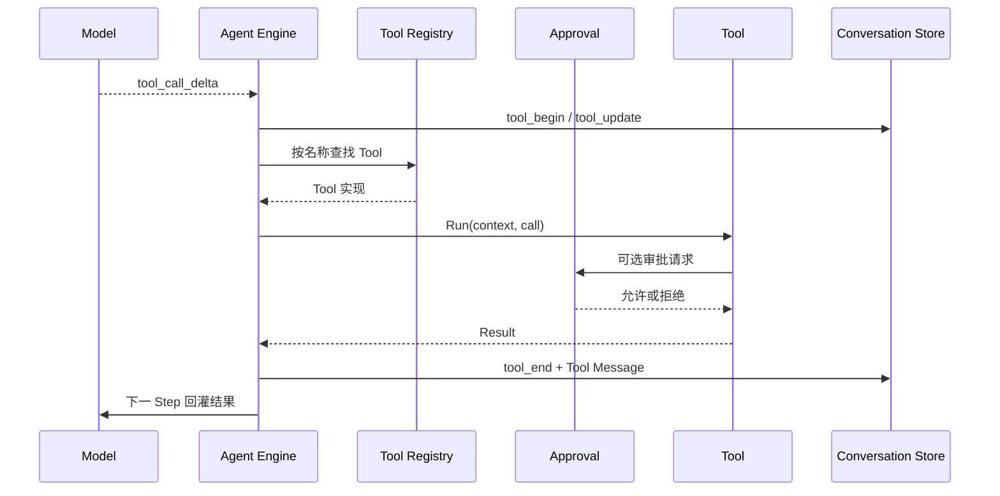

Tool 是模型影响外部世界的统一入口。读取文件、执行命令、访问网页、更新任务和
启动子 Agent，都通过 Tool Runtime 暴露。

模型只能提出工具调用。是否允许、怎样执行以及结果如何保存，由 Foya 内核决定。

## Tool Contract

每个 Tool 都提供：

| 成员 | 作用 |
|---|---|
| Name | Provider 请求中的函数名称 |
| Description | 帮助模型判断何时使用 |
| JSON Schema | 约束工具参数 |
| Exposure | 控制 Tool Schema 何时对模型可见 |
| Run | 接收上下文和调用参数，返回结构化结果 |

一次调用包含稳定 Tool Call ID、工具名称和原始 JSON 参数。Tool Result 可以包含：

- 文本；
- 图片；
- Artifact 引用；
- 错误标记；
- 终止当前批次的信号；
- 文件变化记录；
- 仅供界面展示的 Diff。

工具的业务失败通常作为 `is_error` 结果返回模型，而不是让整个 Agent Runtime
立即崩溃。模型可以读取错误并选择修正参数。

## Tool Registry

Tool Registry 是当前内核中工具名称到实现的统一映射。工具来源包括：

- Foya 内置工具；
- MCP Server 动态工具；
- SubAgent 工具；
- Browser、Canvas 和外部服务适配器。

Registry 负责把 Tool 转换成 Provider 可理解的 Function Schema，并按名称排序，
保证请求结构稳定。

工具注册不代表模型必然能看到或调用它。最终可用集合还会受到 Exposure、Session
工具白名单和运行模式限制。

## 可见性

Tool 使用三种 Exposure：

| Exposure | 行为 |
|---|---|
| `direct` | Schema 从 Turn 开始就进入模型请求 |
| `deferred` | 通过 `tool_search` 激活后才进入下一 Step |
| `hidden` | 不向模型公开 |

Tool Schema 会占用上下文。Deferred Tool 允许大型工具集合保留在 Registry 中，
但只在任务需要时发送给模型。

`tool_search` 根据名称和 Description 搜索 Deferred Tool。匹配结果会被激活，但
激活后的 Schema 从下一次模型 Step 才生效。

## 调用生命周期



模型流式生成调用参数时，Foya 会尽早广播 Tool 已排队。参数完成后才执行工具，
避免运行半段 JSON。

完成结果同时用于两个视图：

- `tool_end` 事件向客户端展示状态、Diff 和附件；
- Tool Message 进入 Canonical History，供下一 Step 使用。

## 运行上下文

Engine 会向工具传递当前运行上下文，包括：

- Session ID 和 Run ID；
- Project ID 和工作目录；
- Approval Mode；
- 当前 Provider 与 Model；
- 当前 Step 已暴露的工具快照；
- Deferred Tool 激活器。

Tool 不应依赖全局可变“当前 Session”。显式上下文让不同 Session 可以安全并发。

## 并行执行

Tool 默认串行执行。只有显式实现 Parallel 能力并返回可并行的工具，才可以与同一
模型响应中的其他并行工具同时运行。

Foya 将一个批次分为：

- 可并行通道；
- 保持模型顺序的串行通道。

单批最多同时运行五个并行 Tool Call。无论实际完成顺序如何，回灌给模型的结果
顺序始终与模型原始 Tool Call 顺序一致。

文件写入、Shell 等可能相互影响的工具不会仅因为看起来独立就自动并行。

## 审批与执行

Tool Registry 决定“有哪些工具”，Approval Gateway 决定“一次调用是否允许”，
Sandbox Runner 决定“允许后的进程实际能访问什么”。

这三个层次不能互相替代：

```text
Schema 可见
  ≠ 调用已批准
  ≠ 操作系统允许全部访问
```

例如 `bash` 即使对模型可见，也需要根据 Session Approval Mode 请求执行权限；
非 Full Access 模式下，进程仍在受限文件系统和网络配置中运行。

详细策略参见[权限系统](./permissions.md)。

## 输出处理

工具结果可能非常大。Foya 在两个阶段控制输出：

### Tool 自身边界

内置读取和命令工具限制最大行数与字节数：

- 文档类输出优先保留开头；
- Shell 输出优先保留结尾；
- 截断结果明确说明省略的行数和字节数。

这保护实时响应和事件存储，不让单次命令无限占用内存。

### Context Projection 边界

已经保存的 Tool Result 在后续请求中仍可能过大。Context Compiler 可以把模型
可见内容替换为头尾摘要和可恢复引用，完整结果仍保留在 Canonical History。

当引用存在时，`history_read_tool_result` 会动态进入工具列表，提供 Inspect、
Read 和 Search。

## 图片与 Artifact

Tool 可以返回图片字节。Engine 会先将图片写入当前 Session 的 Artifact Store，
再把持久化引用放入 Tool Message。

事件日志和 SSE 不直接携带完整二进制。下一次模型请求需要图片时，再从 Artifact
Store 读取并物化。

如果模型不支持图片输入，历史仍保留 Artifact，但 Provider 请求只会收到明确的
省略说明。

## 文件变化

`write` 和 `edit` 除返回文本结果外，还会生成 File Change：

- 文件路径；
- 修改前是否存在；
- 修改前后模式；
- 修改前后内容摘要；
- 可恢复内容 Blob；
- UI 使用的 Unified Diff。

Diff 不回灌模型，避免重复占用上下文；Tool Result 中的文字说明足以让模型知道
操作结果。File Change 用于用户审查和历史回退。

`delete` 不执行永久删除，而是将工作区内的文件或目录移动到操作系统废纸篓。
在 Manual 和 Auto 模式下，它拒绝工作区外路径、工作区根目录以及
`.git`、`.agents`、`.foya` 等受保护目录；常见 Shell 永久删除命令也会被拒绝。
Full Access 模式允许操作这些路径并允许 Shell 删除命令，但 `delete` 仍优先使用
系统废纸篓。文件系统根目录在所有模式下都不可通过 `delete` 移除。

桌面端对成功的 `write`、`edit` 和 `delete` 调用只展示文件变更产物，不重复展示
可能很长的原始参数与文字输出。调用失败时仍展示错误详情。

## 后台命令

`bash` 可以启动由内核管理的后台进程。后台命令拥有独立 ID，可以通过工具查询
状态或取消。

内核只保留有界的标准输出和错误输出，避免长期进程无限增长内存。删除 Session
会清理对应后台命令。

## MCP 工具

MCP Tool 会注册到同一 Registry，并遵守相同的 Provider Schema 和结果回灌流程。
MCP 连接本身不会获得绕过 Foya 权限系统的特权。

MCP Resource 和 Prompt 不是普通 Tool，会通过各自的控制接口读取。

## 取消与错误

Turn 被取消时，执行上下文会向 Tool 传播取消信号。外部进程由 Sandbox Runner
停止进程树。

Foya 不会在重启后自动重放未完成 Tool Call，因为操作可能已经产生部分外部
副作用。调用历史会保留已经确认完成的结果，未完成运行由上层状态标记处理。

## 当前边界

- JSON Schema 约束模型参数，但 Tool 仍必须自行校验输入。
- 并行安全由 Tool 显式声明，Runtime 不做语义推断。
- Deferred Tool 激活只在当前 Turn 生效。
- Tool Result 的业务错误可以交给模型修正，但底层运行时错误仍可能结束 Turn。
- 外部 MCP Tool 的安全性还取决于对应 Server 自身实现。
