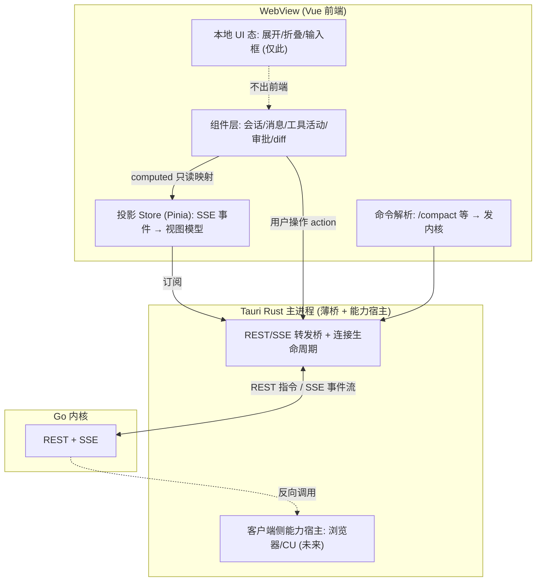

# Foya 前端架构

Foya 前端(Tauri 桌面端)有一个区别于普通 Web app 的根本约束:**前端不持有业务状态,它是内核事件流的投影。** 这是「日志即真相、客户端无状态」在前端的直接后果——真相在 Go 内核,前端只渲染内核推来的事件、把用户操作发回内核。这个约束决定了前端架构的形状。

技术选型:**Vue** 前端 + Tauri(Rust 主进程)。前端架构的形状由上述约束决定,与框架无关;Vue 负责以其响应式方式表达「投影层 + 薄组件」。

配套文档:[架构.md](./架构.md)、[节点抽象设计.md](./节点抽象设计.md)。

---

## 一、分层图

---

## 二、四层职责

| 层 | 职责 | 关键约束 |
|---|---|---|
| 组件层 | 渲染会话、消息、工具活动、审批框、diff、多会话切换 | 只读投影 Store 的视图模型,不自持业务数据 |
| 投影 Store | 订阅 SSE,把事件流按序号归并成视图模型;处理断线重连(Last-Event-ID)与补发 | 前端唯一真相入口,所有业务态从这来 |
| 本地 UI 态 | 面板展开/折叠、输入框内容、滚动位置、主题 | 唯一允许前端自持的状态,不影响业务、不出前端 |
| 命令解析 | 解析 `/` 前缀命令,转成 REST 指令发内核 | 人触发的动作,区别于模型触发的工具 |

---

## 三、投影 Store 是前端的心脏

前端的核心不是组件,是投影层。用 Pinia store 承载「从 SSE 归并出的视图模型」,组件只用 `computed` 只读映射,用户操作通过 action 发 REST。数据流单向:**事件到达 → store 更新 → 组件响应式重渲染**。

归并逻辑要点:

- 收到 `message_delta` → 追加到对应消息的内容。
- 收到 `PermissionRequest` → 弹审批框。
- 收到「已批准/已拒绝」→ 关掉审批框(无论批准来自哪个设备)。
- 收到 `tool_execution_*` → 更新工具活动视图。
- 每个事件带单调序号 `Seq`;断线重连时带 `Last-Event-ID` 补发漏掉的事件。

这一层做对了,多端一致、断线续传、多设备同步全部自动成立——它们本质是同一件事:忠实投影内核事件流。前端不存在「另一份真相」与内核打架。

Vue 适配性:响应式让「事件 → store → 视图」零样板;组件保持薄(纯展示),复杂度集中在 store 的归并逻辑,便于测试。

---

## 四、Rust 主进程:薄桥 + 能力宿主

Rust 主进程只做两件事,业务逻辑一律不放这里(全在 Go 内核):

**REST/SSE 转发桥 + 连接生命周期。** WebView 不直接暴露 socket(符合 Tauri 安全模型),经 Rust 中转:Rust 维护到内核的连接(本地 Unix socket),把 SSE 事件通过 Tauri event 推给 WebView,把 WebView 的指令通过 Tauri command 转成 REST 发内核。也便于未来加鉴权。

**客户端侧能力宿主。** Computer Use、内嵌浏览器的执行落在 Rust 主进程(依赖 native 权限),内核通过反向调用触发。MVP 不实现,但主进程的「能力宿主」角色现在定好——未来加能力是往 `CapHost` 挂,不动前端和桥。

---

## 五、状态归属:纯投影

前端零业务状态,全部从内核 SSE 投影,只保留纯 UI 本地态(面板展开、输入框内容)。

好处是多端天然一致:桌面和手机看到的必然一样,因为都投影自同一个内核事件流,前端没有会与内核冲突的「另一份真相」。

离线浏览历史(断网看会话记录)后置——真要时在投影 Store 下加一层本地缓存,不在 MVP 过早优化。

---

## 六、多端协同示例(前端视角)

agent 请求确认命令,桌面与手机两端都开着:

1. 两端投影 Store 各自收到 `PermissionRequest` 事件 → 各自弹审批框。
2. 你在手机端点「继续」→ 手机端 action 发 `POST /permissions/{id}`。
3. 内核处理后广播「已批准」事件。
4. 桌面端投影 Store 收到该事件 → 自动关掉审批框。

前端不需要为此写特殊逻辑——它只是忠实投影内核事件流的自然结果。谁点、哪个设备点都不重要(单用户),靠 requestID 关联,靠序号补发容错。

---

## 七、规则与记忆

设置页分别提供“规则”和“记忆”两个入口，不能把二者合并成同一列表：

- Rules 是用户制定的行为约束。
- Memory 是后续协作可复用的偏好、事实和经验。
- Memory 页提供全局启用开关；关闭后保留文档，但不注入 Prompt 或自动写入。
- `AGENTS.md` 等文件是 Context Files，不显示为 Foya Rules 或 Memory。

两个页面均支持全局/项目范围、项目选择、新增、编辑和删除。所有操作通过
REST 提交内核；前端订阅实例级 `/context/events`，收到变更后重新读取当前
范围的投影，因此其他设备或 `memory_remember` 工具产生的变化也会显示。
