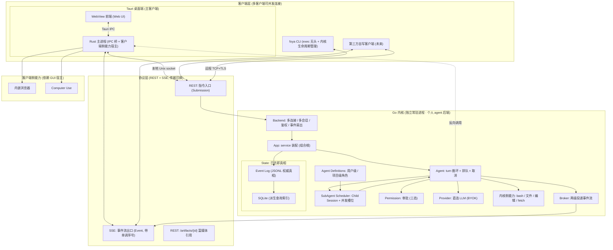

# Foya 架构

Foya 是一个开源、非商业、BYOK(用户自带 API Key)的个人 agent 系统。核心是一个 Go 编写的**独立常驻内核**(个人 agent 后端),Tauri 桌面端与 CLI 是它的客户端;用户可从多设备、多客户端、多会话连接同一内核。内核持有全部会话状态(日志即真相),客户端无状态、从事件流投影。

优先交付**桌面端(Tauri)**与 **CLI(`foya`)**两个入口,协议保持开放,未来第三方客户端可接入。

---

## 一、总装图

---

## 二、四层职责

| 层 | 职责 | 形态 |
|---|---|---|
| 客户端层 | 展示与交互,无会话状态,从事件流投影 | Tauri 桌面 / `foya` CLI / 第三方(未来) |
| 协议层 | 指令进(REST)、事件出(SSE)、富媒体引用(artifact),传输管道可换 | REST+SSE,RunID 关联,Last-Event-ID 补发 |
| Go 内核 | 独立常驻的个人 agent 后端:驱动 agent、持有会话、广播事件、审批、直连模型 | 独立 Go 二进制,常驻/按需两种生命周期 |
| 能力层 | 执行副作用,分内核侧与客户端侧两类 | 内核侧内置 / 客户端侧反向调用 |

---

## 三、Go 内核内部

内核是 Foya 的重心,是**独立进程**——不提供进程内(in-process)模式。桌面端连本地内核也走一次 Unix socket,以此换取多客户端、多设备连接同一内核的能力。

| 模块 | 职责 |
|---|---|
| Backend | 传输无关业务层:管多连接、多会话、事件扇出、实例级鉴权。session 归内核所有,多客户端可订阅同一 session |
| App | 装配层:持有所有 service(session/message/permission/provider)与 agent 协调器,是组合根 |
| Agent | 回合引擎:驱动一个 turn 的模型交互循环;每 session 一把锁做「取消当前 / 排队 / 成为活跃」的分发;回合是可取消的后台 goroutine,主循环永远能响应中断 |
| Agent Definitions | 从用户级与项目级 `.agents/agents/*.md` 动态发现静态智能体定义,启动时冻结为 Child Session 的运行快照 |
| SubAgent Scheduler | 把主 Agent 的派工创建为独立 Child Session,控制并发、取消传播、父子谱系和结果回传 |
| Broker | 事件流:泛型发布订阅,两级投递——高频 token 增量走有损投递(buffer 满即丢),终止类事件(工具结果 / 回合结束 / 审批请求)走必达投递(有界阻塞 + 超时) |
| State | 日志即真相:会话真相是一条带单调序号的追加事件日志(JSONL),SQLite 只是派生查询索引,坏了能从日志重建;压缩只生成带 coverage 的投影 checkpoint,永不改源日志;事件序号同时服务 SSE 断线补发与多设备续接 |
| Permission | 审批:内核内部用 channel 同步阻塞实现,对外暴露成「SSE 推请求 + REST 回决策,request_id 关联」的异步对;三态判定:自动放行 / 问用户 / 拒绝 |
| Provider | BYOK:拿用户自带的 key 直连 provider,token 流量不经任何第三方 |

---

## 四、能力分两类

| 类别 | 例子 | 执行位置 | 原因 |
|---|---|---|---|
| 内核侧能力 | bash、文件读写编辑、web fetch | Go 内核进程 | 不依赖 GUI,任何客户端连上都能用 |
| 客户端侧能力 | 内嵌浏览器、Computer Use | Tauri Rust 主进程 | 依赖屏幕 / WebView / 原生权限,只有 GUI 客户端在时才有意义 |

内核对客户端侧能力只定义契约,通过反向调用(client capability)让持有 GUI 的客户端执行。富媒体(截图 / DOM 快照)走 artifact 引用:存本地 blob,事件只带 URL,SSE 流只走结构化小事件。

---

## 五、部署与生命周期

- **内核独立常驻进程**:不做进程内模式。两种生命周期——`ephemeral`(桌面默认,按需拉起、空闲自动退)与 `service`(常驻守护,多设备场景)。
- **connect-or-spawn**:客户端启动时连已有内核,没有就拉起,用户无感。
- **传输可换、协议不变**:本地 Unix domain socket(靠 OS 文件权限做单用户信任,无需密码);用户自部署远端时 TCP+TLS + 可撤销 Bearer token。REST+SSE 协议在两种传输下完全一致。
- **分发**:Go 内核编译为单二进制,作为 Tauri sidecar 随安装包分发;用户下载安装后填 API Key 即用。云端为用户自部署选项,Foya 不运营任何服务。

---

## 六、优先级

现在做实:Go 内核(Backend/App/Agent/Broker/State/Permission/Provider)、REST+SSE 协议、Tauri 桌面端、`foya` CLI、内核侧能力、本地 Unix socket 传输、JSONL+SQLite 持久化、BYOK 直连。

留好接口、后置实现:远程 TCP+TLS 传输 + Bearer 鉴权、客户端侧能力(内嵌浏览器 / Computer Use)、上下文压缩的完整投影 checkpoint、多设备并发订阅同一 session。

因骨架立对(日志即真相 + 传输可换 + 独立进程 + 能力分层),后置项均为向上扩展,不返工。
